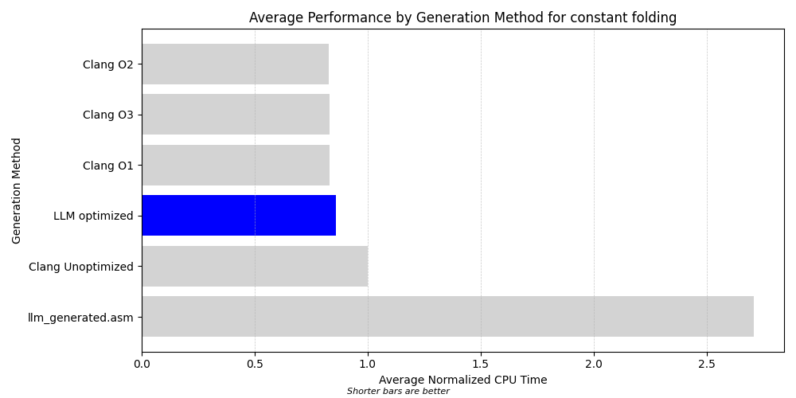

# Generative Compilation

This project evaluates the code compilation and optimization capabilities of large language models (LLMs). In particular, it focuses on the compilation of C source units to assembly language and the optimization of that assembly. It gauges the performance and correctness of the generated assembly by Clang-generated assembly as "ground truth".

## Motivation

With the rapid advancement of large language machine learning models, the boundaries of what these models can accomplish are continuously expanding. Traditionally, tasks like code compilation and optimization were exclusively the domain of dedicated software like compilers. This project aims to explore what large language models can achieve in the realm of code compilation and optimization. By pitting these models against traditional compilers, we can gauge the potential of AI in this domain, understand its limitations, and envision future collaboration between traditional software and AI models.

<why is this novel?>

## Approach

The project's methodology can be broken down into the following steps:

1. **Technique Identification:** Recognize simple optimization techniques typically employed by C compilers.
2. **Problem Generation:** Leverage an LLM like GPT-4 to create coding challenges. Each challenge consists of a C compilation unit that is prime for optimization using the identified techniques.
3. **Compilation with Clang:** Generate assembly code for the provided problems using Clang at various optimization settings, notably `-O0`, where optimizations are turned off.
4. **Test Generation** Task an LLM with creating tests for each coding problem. These tests will validate the answers against both LLM-generated Python functions and the Clang-produced assembly.
5. **Optimization by LLM:** Ask the LLM to refine the unoptimized assembly churned out by Clang. The improved assembly will then be confirmed using the generated tests.
6. **Direct Assembly Generation by LLM:** Without any guidance from Clang, the LLM will be asked to produce its assembly for the problem. This assembly will be validated using the generated tests.
7. **Performance Measurement:** Quantify the CPU time for both the Clang-generated and LLM-produced assembly implementations. This will be achieved using a test driver that runs the assembly a configurable number of times.
8. **Performance Comparison:** Contrast the efficiency of each implementation to derive insights about the LLM's optimization capabilities.

## Language Models Used

Throughout this project, different iterations of OpenAI's GPT series of technologies were evaluated:

- **GPT-4:** This was the primary model used due to its advanced capabilities and the availability of its Advanced Data Analysis mode.
- **GPT-3.5:** While it was tested, GPT-3.5 exhibited challenges in consistently reasoning about assembly language. We chose to focus on GPT-4.
- **OpenAI API:** The API was not utilized because direct access to GPT-4's Advanced Data Analysis mode proved more beneficial for the project's objectives.

## Techniques

The project examined five optimization techniques commonly used by compilers:

- **Constant Folding**: This technique involves pre-evaluating constant expressions during compile time rather than at runtime.
- **Copy Propagation**: This technique replaces the uses of a variable with the value that is known to have been assigned to that variable, aiming to reduce redundant loads and simplify the code.
- **Dead Code Elimination**: This technique removes code that does not affect the program's output.
- **Loop Unrolling**: This technique increases the number of iterations of a loop in each loop cycle.
- **Strength Reduction**: This technique replaces expensive operations with equivalent but cheaper operations.

These techniques were chosen because they can be applied to relatively simple code that an LLM is likely to be able to understand. Other techniques such as function inlining and tail recursion optimization were considered, but it proved difficult to get the LLM to reason correctly about source code that can be optimized using these techniques.

## Future Directions

There are many possible future directions that this work could take, which could be explored in a future project or for a research paper.


- Different LLMs: While GPT-3.5 did not appear suited to this task, it would be interesting to test the performance of Bard and Claude as well.
- Prompt engineering: With the prompts used here, GPT-4 struggled to reason correctly about more complex code, particularly code with nested loops and with properly saving and restoring register state when making function calls. It also sometimes struggled to identify and correct more subtle mistakes in the assembly it generated.
	- Encouraging the LLM to use chain-of-thought prompting, possibly across multiple interactions, may lead to better reasoning and fewer errors. In particular, it would be interesting to ask the LLM to split more complex code into smaller chunks.
	- One technique commonly used in debugging is tracing through the code with test inputs. It would be interesting to create prompts that encourage the LLM to test its generated code. For example, we could use the Persona pattern to ask the LLM to act as a virtual machine that executes assembly instructions.
	- Generating multiple different implementations for the same source code, then asking the LLM to evaluate them, combining them into an ultimate "best" answer.
- This project measured CPU performance only. Other performance characteristics, like code size and memory usage, could also be measured. More complex problems could also be evaluated against disk I/O activity.


- From an implementation perspective, the project could be integrated with the OpenAI API to fully automate the generation of solutions. This requires adding the ability to identify runtime crashes and hangs and provide feedback to the LLM, which was done manually for this project. It would be straightforward to test the LLM-generated code with a debugger attached and to provide the debugger output to the LLM.

## Results




## Running the Generation

1. **Generate Problems** (Optional):
	The repository already contains generated problems. To generate new problems in the same format, use the prompt style in [LINK](prompts/problem_generation.txt).
	
2. **Clean Repository** (Optional):
	Most the tools in the repository do not replace already-generated data. To start the process from scratch, run:

	```bash
	python3 clean_repository.py problems
	```

3. **Generate Solutions**:
	Run the following command, which generates solutions for each problem. When input is needed from the LLM, it outputs the prompt to `stdout` and reads the response from `stdin`.
	
	If a compilation, linking, or testing error occurs with the assembly generated by the LLM, the script provides the error to the LLM and asks for corrected assembly.
	
	```bash
	python3 generate_solutions.py problems
	```

4. **Profile the Solutions**:
	If you wish to profile the performance of the solutions, run:
	```bash
	python3 profile_solutions.py problems
	```

5. **Visualize Results**:
	After testing and profiling, you can visualize the results using:
	```bash
	python3 visualize_results.py problems analysis
	```
	
	This will generate performance graphs for each problem in the `analysis` subdirectory.
