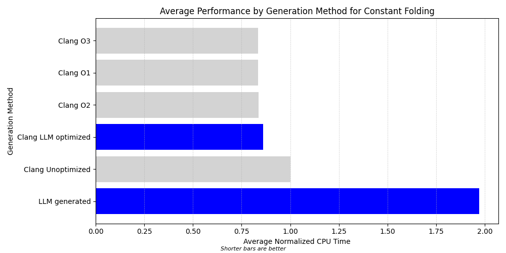
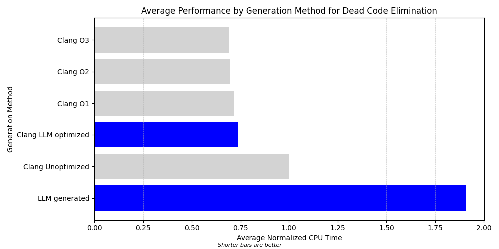
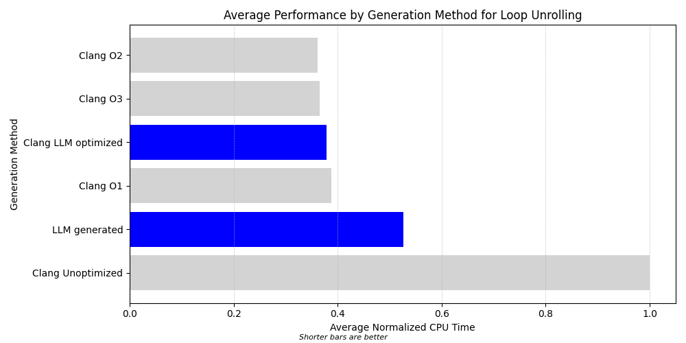
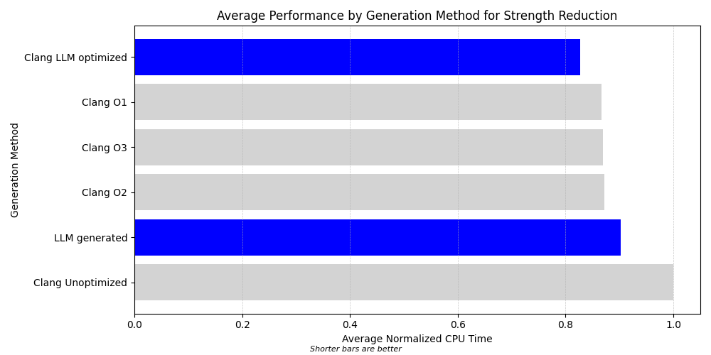

# Generative Compilation

This project evaluates the code compilation and optimization capabilities of large language models (LLMs). In particular, it focuses on the compilation of C source units to assembly language and the optimization of that assembly. It gauges the performance and correctness of the generated assembly by Clang-generated assembly as "ground truth".

## Motivation

With the rapid advancement of large language machine learning models, the boundaries of what these models can accomplish are continuously expanding. Traditionally, tasks like code compilation and optimization were exclusively the domain of dedicated software like compilers. This project aims to explore what large language models can achieve in the realm of code compilation and optimization. By pitting these models against traditional compilers, we can gauge the potential of AI in this domain, understand its limitations, and envision future collaboration between traditional software and AI models.

While LLMs have been used in other software engineering domains like code completion [1] and solving coding challenges [2], and in particular have been used to improve compiler error generation and correct errors in higher-level language code, this is the first time an LLM has been employed to generate and optimize assembly directly.

This project is a first step towards evaluating the ability of LLMs to generate machine-executable instructions. While it is unlikely that a LLM will replace a production C compiler, the potential for LLMs to compile code written in pseudo-language or in languages that are normally interpreted is intriguing. It is also possible to envision a world where new programming languages are prototyped using LLMs, allowing for more rapid iteration during the language design process.

## Approach

The project's methodology can be broken down into the following steps:

1. **Technique Identification:** Recognize simple optimization techniques typically employed by C compilers. [See prompt and response.](prompts/optimization_techniques.txt)
2. **Problem Generation:** Leverage an LLM like GPT-4 to create coding challenges. Each challenge consists of a C compilation unit that is prime for optimization using the identified techniques. All of the problems use the same function signature. [See prompts.](prompts/problem_generation.txt)
3. **Compilation with Clang:** Generate assembly code for the provided problems using Clang at various optimization settings, notably `-O0`, where optimizations are turned off.
4. **Test Generation:** Task an LLM with creating tests for each coding problem. The correctness of the test cases are validated using both LLM-generated Python functions and the Clang-produced assembly. [See prompts.](prompts/test_case_generation.txt)
5. **Optimization by LLM:** Ask the LLM to refine the unoptimized assembly churned out by Clang. The improved assembly is compiled, linked, and run against the generated tests. If errors occur, the LLM is given the error and asked to correct the assembly. [See sample prompts.](prompts/optimize_assembly.txt)
6. **Direct Assembly Generation by LLM:** Without any guidance from Clang, the LLM is asked to produce its assembly for the problem. This assembly is compiled, linked, and run against the generated tests. If errors occur, the LLM is given the error and asked to correct the assembly. [See sample prompts.](prompts/generate_assembly.txt)
	- **Note:** For a large proportion of the problems, GPT-4 was unable to generate correct assembly with the prompting methods used. As a result, results are not available for all optimization types. See [Future Directions](#future_directions) for ideas to elicit better results.
7. **Performance Measurement:** The Clang-generated and LLM-produced assembly implementations are run using a test driver, and their CPU performance is measured. The test driver that runs the assembly a configurable number of times; for simple functions, a large number of iterations are used to reduce variance.
8. **Performance Comparison:** Contrast the efficiency of each implementation to derive insights about the LLM's optimization capabilities.

## Language Models Used

Throughout this project, different components of OpenAI's GPT series of technologies were evaluated:

- **GPT-4:** This was the primary model used due to its advanced capabilities and the availability of its Advanced Data Analysis mode.
- **GPT-3.5:** While it was tested, GPT-3.5 exhibited challenges in consistently reasoning about assembly language. We chose to focus on GPT-4.
- **OpenAI API:** The API was not utilized because direct access to GPT-4's Advanced Data Analysis mode provides more tools for the LLM to use when generating its answer. In addition, since the model generates better results when it is able to explain its reasoning, the web interface makes token limit, parsing, and cost issues less of an issue.

## Optimization Techniques

The project examined five optimization techniques commonly used by compilers:

- **Constant Folding**: This technique involves pre-evaluating constant expressions during compile time rather than at runtime.
- **Copy Propagation**: This technique replaces the uses of a variable with the value that is known to have been assigned to that variable, aiming to reduce redundant loads and simplify the code.
- **Dead Code Elimination**: This technique removes code that does not affect the program's output.
- **Loop Unrolling**: This technique increases the number of iterations of a loop in each loop cycle.
- **Strength Reduction**: This technique replaces expensive operations with equivalent but cheaper operations.

These techniques were chosen because they can be applied to relatively simple code that an LLM is likely to be able to understand. Other techniques such as function inlining and tail recursion optimization were considered, but it proved difficult to get the LLM to reason correctly about source code that can be optimized using these techniques.

## Results

A summary of the results is below. The [test cases and performance results for each problem](analysis/charts.md) are also available.

### Overall results

The graph below shows the performance of assembly generated by the LLM. Bars in **blue** show the performance of assembly output by the LLM; bars in **gray** show the performance of Clang-generated assembly at various optimization levels for comparison.


- **Clang LLM Optimized:** Clang was used to generate unoptimized assembly (-O0). That assembly and the original compilation unit were provided to the LLM.
	- Overall, we were successful in having GPT-4 optimize Clang-generated assembly for a given compilation unit, and the assembly performed better than the original, but largely not as well as fully-optimized Clang assembly.
- **LLM Generated:** The LLM was provided with the original compilation unit and asked to generate assembly.
	- GPT-4 was eventually able to generate assembly directly from the C compilation unit for all of the problems, but struggled at times to generate code that compiled, linked, ran, and passed tests for more complicated problems. Further prompt engineering may help GPT solve more complex problems with fewer mistakes. See the [Future Directions](#future-directions) section.
	- In some cases, the assembly generated by the LLM performed significantly worse than the unoptimized Clang assembly.

### Constant Folding

- The LLM-optimized assembly achieved performance close to that of the optimized Clang assembly.
- The LLM-generated assembly performed very poorly, far worse than the unoptimized Clang assembly.



### Copy Propagation

- The LLM-optimized assembly matched the performance of the optimized Clang assembly.


### Dead Code Elimination

- The LLM-optimized assembly achieved performance close to that of the optimized Clang assembly.



### Loop Unrolling

- The LLM-optimized assembly achieved performance better than the -O1 optimized Clang assembly, but worse than the -O2 and -O3 optimized Clang assembly.



### Strength Reduction

- The LLM-optimized assembly achieved performance better than any of the Clang-optimized assembly.




## Future Directions

There are many possible future directions that this work could take, which could be explored in a future project or for a research paper.

- **Different LLMs:** While GPT-3.5 did not appear suited to this task, it would be interesting to test the performance of Bard and Claude as well.
- **Result verification:** In cases where the LLM performed better than Clang, it is wise to investigate why. While the assembly was tested for correctness, it is possible that the LLM's code is unsafe or incorrect in ways not detected by the test.
	- In particular, tools like static analyzers and fuzzers could be used for verification.
- **Optimizing LLM-generated assembly:** This project only optimized assembly generated by Clang. It would be interesting to try optimizing code that the LLM itself wrote, possibly in an iterative fashion. ("Are there any more optimizations you can make?")
- **Variance Determination**: Only one solution was generated for each problem. It would be interesting to generate multiple solutions for the same problem and evaluate the level of variance in the assembly produced and its resulting performance.
- **Prompt engineering:** With the prompts used here, GPT-4 struggled to reason correctly about more complex code, particularly code with nested loops and with properly saving and restoring register state when making function calls. It also sometimes struggled to identify and correct more subtle mistakes in the assembly it generated.
	- Encouraging the LLM to use chain-of-thought prompting [3], possibly across multiple interactions, may lead to better reasoning and fewer errors. In particular, it would be interesting to ask the LLM to split more complex code into smaller chunks.
	- One technique commonly used in debugging is tracing through the code with test inputs. It would be interesting to create prompts that encourage the LLM to test its generated code. For example, we could use the Persona pattern to ask the LLM to act as a virtual machine that executes assembly instructions.
	- Generating multiple different implementations for the same source code, then asking the LLM to evaluate them, combining them into an ultimate "best" answer.
	- Providing "hints" to the LLM, asking it to perform various optimization techniques by name and profiling the resulting assembly.
- **Additional optimization techniques:** Improved prompt engineering may make it feasible to attempt more complex optimizations like function inlining.
- **Performance dimensions:** This project measured CPU performance only. Other performance characteristics, like code size and memory usage, could also be measured. More complex problems could also be evaluated against disk I/O activity.
- **Other languages:** This approach could be applied to programming languages that are usually interpreted, not compiled. It could also be applied to translate pseudocode directly into machine-executable instructions.
- **Use of intermediate representations:** Compilers work in stages and generate intermediate artifacts (e.g., abstract syntax trees) along the way. It would be interesting to explore how effective LLMs are at generating those intermediate representations, and if using them improves the quality of the assembly generated.

From an implementation perspective:
- **API integration:** The project could be integrated with the OpenAI API to fully automate the generation of solutions. This requires adding the ability to identify runtime crashes and hangs and provide feedback to the LLM, which was done manually for this project. It would be straightforward to test the LLM-generated code with a debugger attached and to provide the debugger output to the LLM.
- **Larger, more diverse problem pool**: A greater number of problems could be used for each optimization technique, and they could be gathered from sources like compiler test suites to see how the LLM fares with tricky optimizations that compilers know how to handle.

## Project Structure

### Key Files

- **[generate_solutions.py](generate_solutions.py):** Entry point for steps 3-6 in the [Approach](#approach) section. Compiles problems, generates test and verifies test cases, prompts LLM to generate and optimize assembly, tests assembly against test cases. Creates a `generated` subdirectory and `test_data.csv` file in each problem directory.
- **[compilation.py](compilation.py):** Helper functions that compile and link code using Clang.
- **[profile_solutions.py](profile_solutions.py):** Performs performance testing on the generated assembly for each problem, creating a `performance_results.txt` file in each problem directory.
- **[visualize_results.py](visualize_results.py):** Creates graphs showing the performance results for each problem as well as average results for each technique.

### Running the Generation

1. **Generate Problems** (Optional):
	The repository already contains generated problems. To generate new problems in the same format, use the prompt style in [LINK](prompts/problem_generation.txt).
	
2. **Clean Repository** (Optional):
	Most the tools in the repository do not replace already-generated data. You can remove the data in the repository using the `clean.py` script.

	- To remove everything except the problem definitions:
	  ```bash
	  python3 clean.py all
	  ```
	- To remove the test data:
	  ```bash
	  python3 clean.py tests
	  ```
	- To remove the generated assembly:
	  ```bash
	  python3 clean.py generated
	  ```
	- To remove the performance results:
	  ```bash
	  python3 clean.py performance
	  ```
	- To remove the visualizations:
	  ```bash
	  python3 clean.py analysis
	  ```


3. **Generate Solutions**:
	Run the following command, which generates solutions for each problem. When input is needed from the LLM, it outputs the prompt to `stdout` and reads the response from `stdin`.
	
	If a compilation, linking, or testing error occurs with the assembly generated by the LLM, the script provides the error to the LLM and asks for corrected assembly.
	
	```bash
	python3 generate_solutions.py problems
	```

4. **Profile the Solutions**:
	If you wish to profile the performance of the solutions, run:
	```bash
	python3 profile_solutions.py problems
	```

5. **Visualize Results**:
	After testing and profiling, you can visualize the results using:
	```bash
	python3 visualize_results.py problems analysis
	```
	
	This will generate performance graphs for each problem in the `analysis` subdirectory.

## References

[1] “GitHub Copilot · Your AI pair programmer,” GitHub. https://github.com/features/copilot (accessed Sep. 03, 2023).

[2] Y. Li et al., “Competition-level code generation with AlphaCode,” Science, vol. 378, no. 6624, pp. 1092–1097, Dec. 2022, doi: 10.1126/science.abq1158.

[3] J. Wei et al., “Chain-of-Thought Prompting Elicits Reasoning in Large Language Models.” arXiv, Jan. 10, 2023. doi: 10.48550/arXiv.2201.11903.

