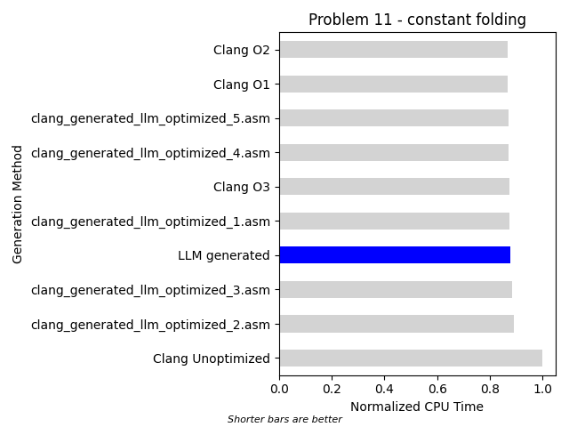

## Problem 11
### Compilation Unit
```c

void customFunction(int int1, int int2, 
                    double double1, double double2, 
                    int *outInt, double *outDouble) {
    *outInt = (int1 + 10 - 5) * (int2 + 5 - 2);
}

```
### Results


