## Problem 01
### Compilation Unit
```c

void customFunction(int int1, int int2, 
                    double double1, double double2, 
                    int *outInt, double *outDouble) {
    *outInt = int1 * 1 + 0;
    *outDouble = double1 * 1.0 + 0.0;
}
    
```
### Results


## Problem 02
### Compilation Unit
```c

void customFunction(int int1, int int2, 
                    double double1, double double2, 
                    int *outInt, double *outDouble) {
    *outInt = int1 * 0;
    *outDouble = double1 * 0.0;
}
    
```
### Results


## Problem 03
### Compilation Unit
```c

static int power(int base, int exp) {
    int result = 1;
    for(int i = 0; i < exp; i++) {
        result *= base;
    }
    return result;
}

void customFunction(int int1, int int2, 
                    double double1, double double2, 
                    int *outInt, double *outDouble) {
    *outInt = power(int1, 1);
    *outDouble = power(double1, 0);
}
    
```
### Results
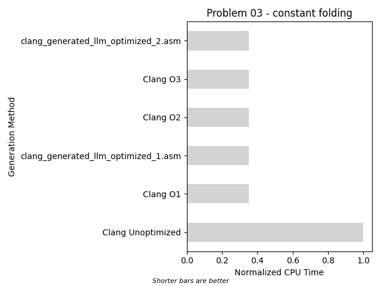

## Problem 04
### Compilation Unit
```c

void customFunction(int int1, int int2, 
                    double double1, double double2, 
                    int *outInt, double *outDouble) {
    *outInt = (int1 * int2) + 0;
    *outDouble = double1 * double2;
}
    
```
### Results
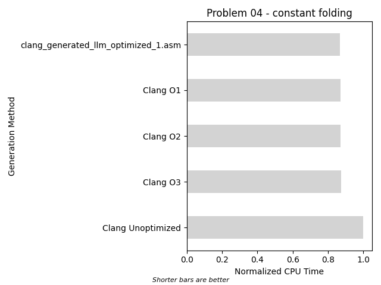

## Problem 05
### Compilation Unit
```c

void customFunction(int int1, int int2, 
                    double double1, double double2, 
                    int *outInt, double *outDouble) {
    int sum1 = int1 + int2;
    int sum2 = int1 + int2;
    *outInt = sum1 - sum2;
    *outDouble = double1 * double2;
}
    
```
### Results
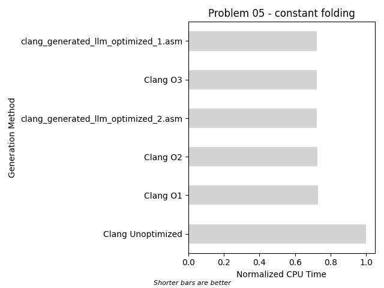

## Problem 06
### Compilation Unit
```c

void customFunction(int int1, int int2, 
                    double double1, double double2, 
                    int *outInt, double *outDouble) {
    *outInt = (int1 + 10 - 5) * (int2 + 5 - 2);
}

```
### Results


## Problem 07
### Compilation Unit
```c

void customFunction(int int1, int int2, 
                    double double1, double double2, 
                    int *outInt, double *outDouble) {
    int part1 = int1 * int2 + int1 - int2;
    int part2 = int1 * int2 - int1 + int2;
    *outInt = part1 + part2 - int1 * int2;
    *outDouble = double1 + double2;
}
    
```
### Results


## Problem 08
### Compilation Unit
```c

void customFunction(int int1, int int2, 
                    double double1, double double2, 
                    int *outInt, double *outDouble) {
    int base = int1 * 2 + int2 / 2;
    if (base > 10) {
        *outInt = base + int1 - int2;
    } else {
        *outInt = base - int1 + int2;
    }
    *outDouble = double1 + double2;
}
    
```
### Results
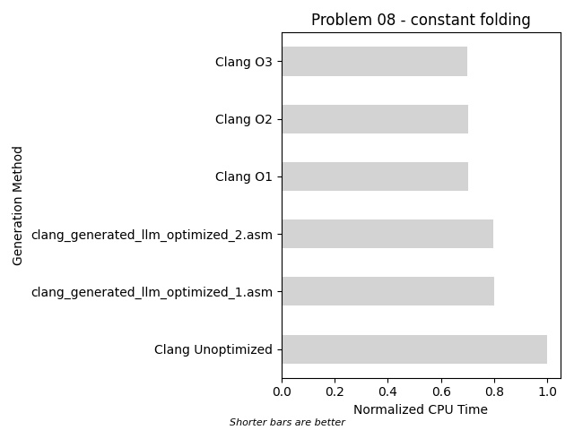

## Problem 09
### Compilation Unit
```c

void customFunction(int int1, int int2, 
                    double double1, double double2, 
                    int *outInt, double *outDouble) {
    int temp = int1 + 4 - 2;
    *outDouble = double2 + temp - 1.0;
}

```
### Results


## Problem 10
### Compilation Unit
```c

void customFunction(int int1, int int2, 
                    double double1, double double2, 
                    int *outInt, double *outDouble) {
    *outInt = int1 - (5 + 3 - 2) + int2;
}

```
### Results
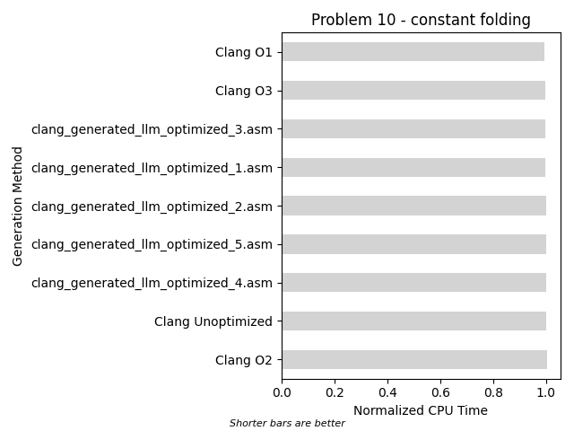

## Problem 11
### Compilation Unit
```c

void customFunction(int int1, int int2, 
					double double1, double double2, 
					int *outInt, double *outDouble) {
    int a = int1;
    a += int2;
    *outInt = int2;
    *outDouble = double1 + double2;
}

```
### Results
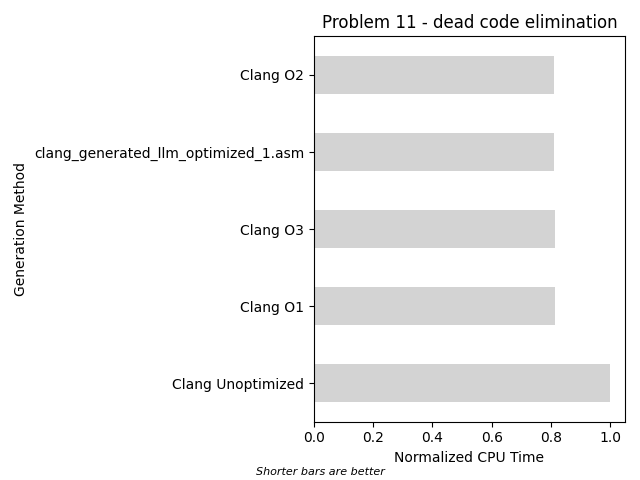

## Problem 12
### Compilation Unit
```c

void customFunction(int int1, int int2, 
					double double1, double double2, 
					int *outInt, double *outDouble) {
    for (int i = 0; i < int1; i++) {
        int tmp = int1 * int2;
    }
    *outInt = int2;
    *outDouble = double1 + double2;
}

```
### Results
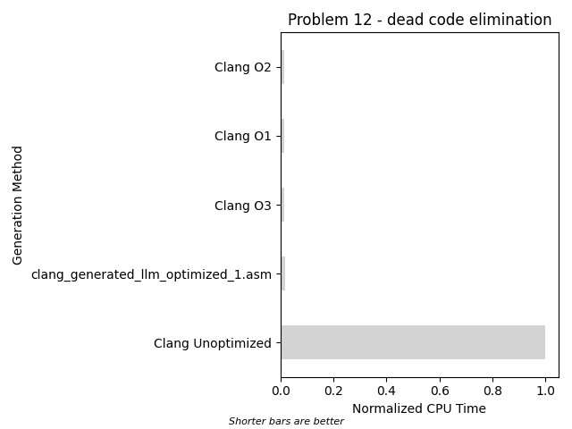

## Problem 13
### Compilation Unit
```c

void customFunction(int int1, int int2, 
					double double1, double double2, 
					int *outInt, double *outDouble) {
    int var1 = int1 * 2;
    int var2 = int2 * 3;
    double var3 = double1 / 2;
    
    *outInt = int1 + int2;
    *outDouble = double1 + double2;
}

```
### Results
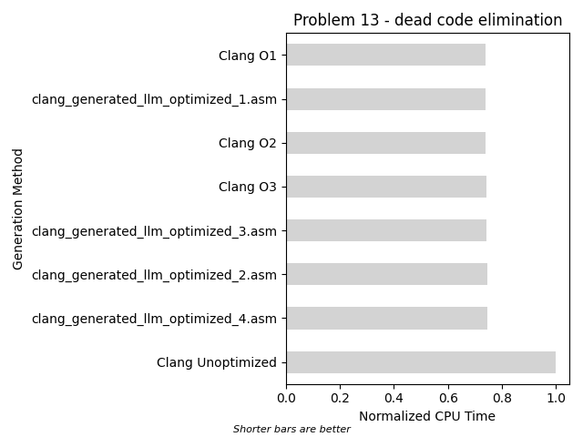

## Problem 14
### Compilation Unit
```c

void customFunction(int int1, int int2, 
                    double double1, double double2, 
                    int *outInt, double *outDouble) {
    if (int1 > 5) {
        *outInt = int1;
        return;
    }
    *outInt = int1 + int2;
    *outDouble = double1 - double2;
}

```
### Results
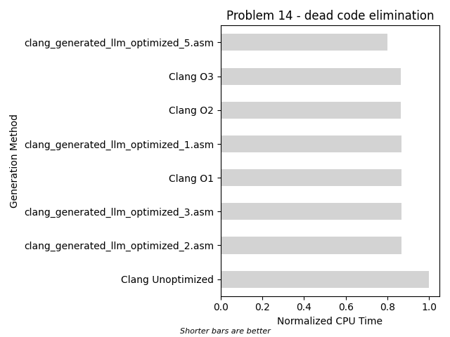

## Problem 15
### Compilation Unit
```c

void customFunction(int int1, int int2, 
                    double double1, double double2, 
                    int *outInt, double *outDouble) {
    if (int1 && !int1) {
        *outInt = int1 - int2; // This will never be executed
    }
    *outDouble = double1 + double2;
}

```
### Results
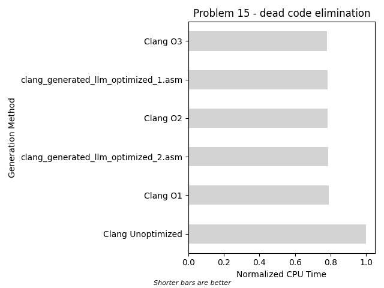

## Problem 16
### Compilation Unit
```c

void customFunction(int int1, int int2, 
					double double1, double double2, 
					int *outInt, double *outDouble) {
    int tmp1 = int1 * 2;
    int tmp2 = int2 - 5;
    int tmp3 = int1 + int2;
    *outInt = tmp3;
    double tmpDouble1 = double1 / 2;
    double tmpDouble2 = double2 * 3;
    *outDouble = double1 + double2;
}

```
### Results
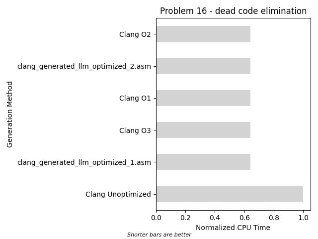

## Problem 17
### Compilation Unit
```c

void customFunction(int int1, int int2, 
                    double double1, double double2, 
                    int *outInt, double *outDouble) {
    *outInt = int1;
    *outInt = int2;
    *outDouble = double1 + double2;
}

```
### Results
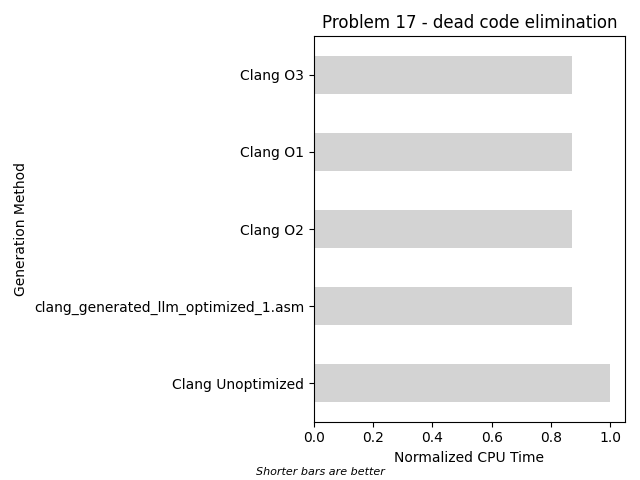

## Problem 18
### Compilation Unit
```c

void customFunction(int int1, int int2, 
					double double1, double double2, 
					int *outInt, double *outDouble) {
    *outInt = int1;
    for (int i = 0; i < int1; i++) {
        if (i % 2 == 0) {
            *outInt = int1 + int2;
        }
    }
    *outInt = int1 - int2;
    *outDouble = double1 + double2;
}

```
### Results
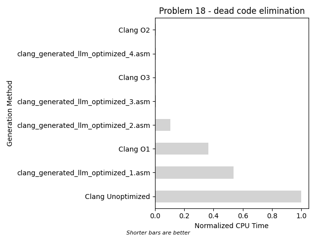

## Problem 19
### Compilation Unit
```c

void customFunction(int int1, int int2, 
                    double double1, double double2, 
                    int *outInt, double *outDouble) {
    int temp = int1;
    temp = int2;
    *outInt = temp;
    *outDouble = double1 + double2;
}

```
### Results
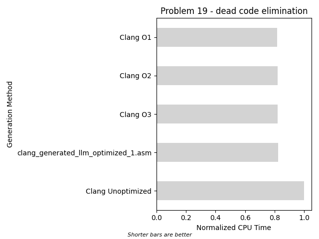

## Problem 20
### Compilation Unit
```c

void customFunction(int int1, int int2, 
                    double double1, double double2, 
                    int *outInt, double *outDouble) {
    if (int1 > int2 && int1 < int2) {
        *outInt = int1 - int2;
    }
    *outDouble = double1 + double2;
}

```
### Results
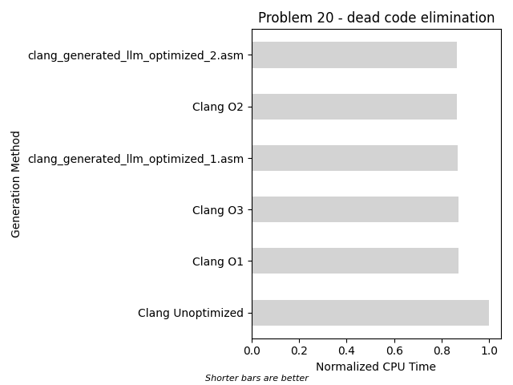

## Problem 21
### Compilation Unit
```c

void customFunction(int int1, int int2, double double1, double double2, int *outInt, double *outDouble) {
    *outInt = int1 * 8;
    *outDouble = double2 * 16.0;
}

```
### Results


## Problem 22
### Compilation Unit
```c

void customFunction(int int1, int int2, double double1, double double2, int *outInt, double *outDouble) {
    *outInt = int1 + int1 + int1 + int1 + int1;
    *outDouble = double1 + double1 + double1 + double1 + double1 + double1;
}

```
### Results


## Problem 23
### Compilation Unit
```c

void customFunction(int int1, int int2, double double1, double double2, int *outInt, double *outDouble) {
    *outInt = int1 * int1 * int1 * int1;
    *outDouble = double1 * double1 * double1 * double1;
}

```
### Results
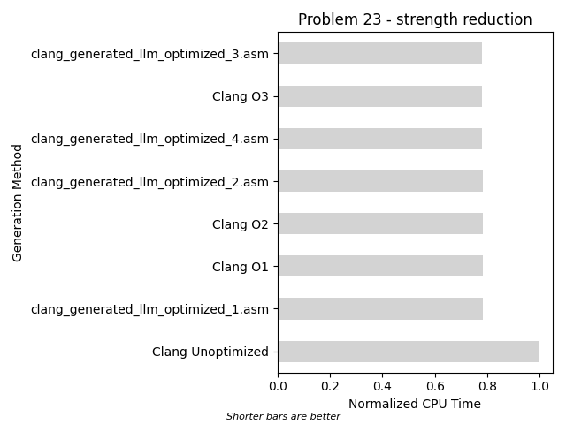

## Problem 24
### Compilation Unit
```c

void customFunction(int int1, int int2, double double1, double double2, int *outInt, double *outDouble) {
    *outInt = int1 * (4 + 4);
    *outDouble = double2 * (8 + 8);
}

```
### Results
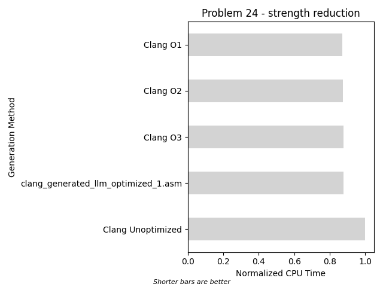

## Problem 25
### Compilation Unit
```c

void customFunction(int int1, int int2, double double1, double double2, int *outInt, double *outDouble) {
    *outInt = (int1 * 7) + int1;
    *outDouble = (double1 * 15) + double1;
}

```
### Results
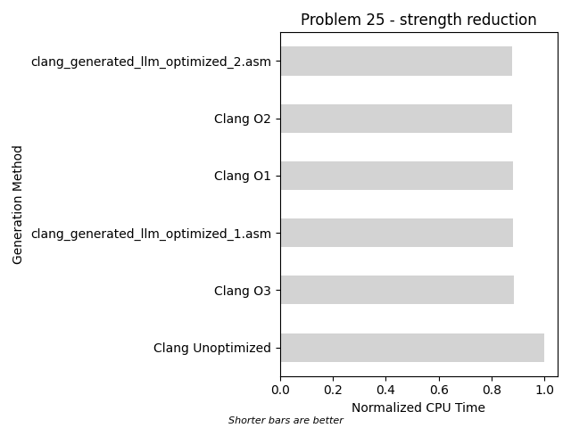

## Problem 26
### Compilation Unit
```c

void customFunction(int int1, int int2, double double1, double double2, int *outInt, double *outDouble) {
    *outInt = (int1 * 4) + int1 + int1;
    *outDouble = (double1 * 5) + double1 + double1 + double1;
}

```
### Results


## Problem 27
### Compilation Unit
```c

void customFunction(int int1, int int2, double double1, double double2, int *outInt, double *outDouble) {
    *outInt = (int1 + 2) * (int2 + 3);
    *outDouble = (double1 + 1.0) * (double2 + 2.0);
}

```
### Results


## Problem 28
### Compilation Unit
```c

void customFunction(int int1, int int2, double double1, double double2, int *outInt, double *outDouble) {
    *outInt = (int1 * 6) - (int1 * 2);
    *outDouble = (double1 * 7) - (double1 * 3);
}

```
### Results
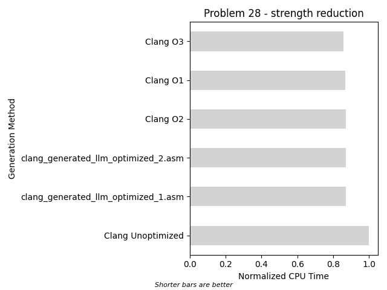

## Problem 29
### Compilation Unit
```c

void customFunction(int int1, int int2, double double1, double double2, int *outInt, double *outDouble) {
    *outInt = (int1 * 3) + (int1 * 4);
    *outDouble = (double1 * 2) + (double1 * 5);
}

```
### Results
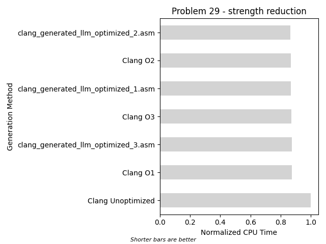

## Problem 30
### Compilation Unit
```c

void customFunction(int int1, int int2, double double1, double double2, int *outInt, double *outDouble) {
    *outInt = (int1 * 6) * 0.5;
    *outDouble = (double1 * 8) * 0.25;
}

```
### Results
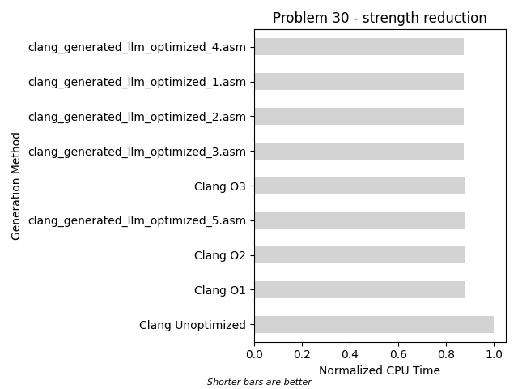

## Problem 31
### Compilation Unit
```c

void customFunction(int int1, int int2, double double1, double double2, int *outInt, double *outDouble) {
    int a = int1;
    int b = a;
    *outInt = b;
    double x = double1;
    double y = x;
    *outDouble = y;
}

```
### Results
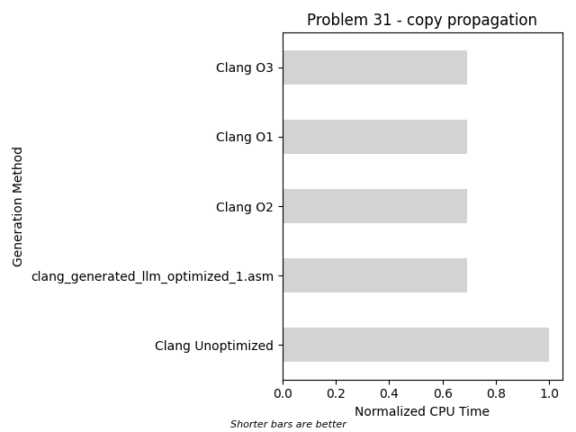

## Problem 32
### Compilation Unit
```c

void customFunction(int int1, int int2, double double1, double double2, int *outInt, double *outDouble) {
    int a = int1 * 2;
    int b = a;
    *outInt = b;
    double x = double1 * 0.5;
    double y = x;
    *outDouble = y;
}

```
### Results
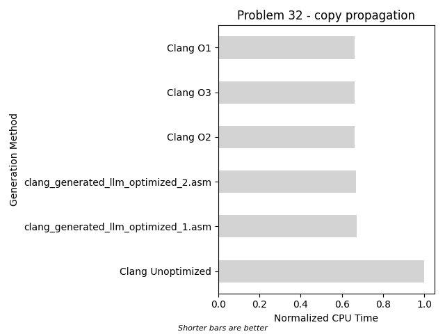

## Problem 33
### Compilation Unit
```c

void customFunction(int int1, int int2, double double1, double double2, int *outInt, double *outDouble) {
    int a = int1 - int2;
    int b = a;
    *outInt = b;
    double x = double2 + double1;
    double y = x;
    *outDouble = y;
}

```
### Results
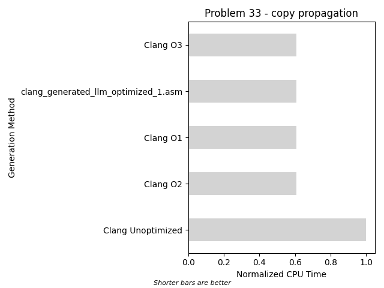

## Problem 34
### Compilation Unit
```c

void customFunction(int int1, int int2, double double1, double double2, int *outInt, double *outDouble) {
    int a = int1 * 3;
    int b = a;
    *outInt = b;
    double x = double2 * 0.25;
    double y = x;
    *outDouble = y;
}

```
### Results
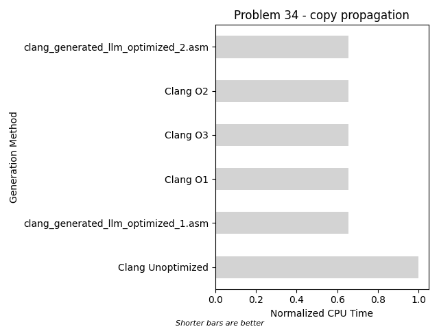

## Problem 35
### Compilation Unit
```c

void customFunction(int int1, int int2, double double1, double double2, int *outInt, double *outDouble) {
    int a = int2 * 4;
    int b = a;
    *outInt = b;
    double x = double2 * 0.75;
    double y = x;
    *outDouble = y;
}

```
### Results
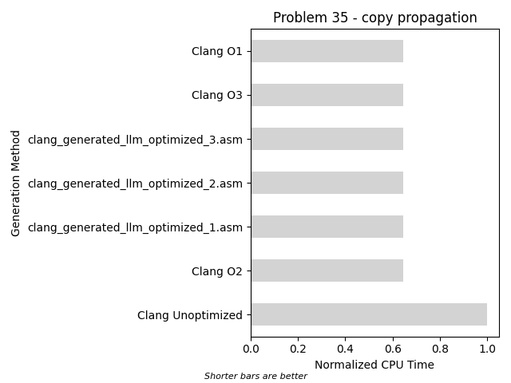

## Problem 36
### Compilation Unit
```c

void customFunction(int int1, int int2, double double1, double double2, int *outInt, double *outDouble) {
    int a = int1 + 5;
    int b = a;
    *outInt = b;
    double x = double1 * 1.1;
    double y = x;
    *outDouble = y;
}

```
### Results
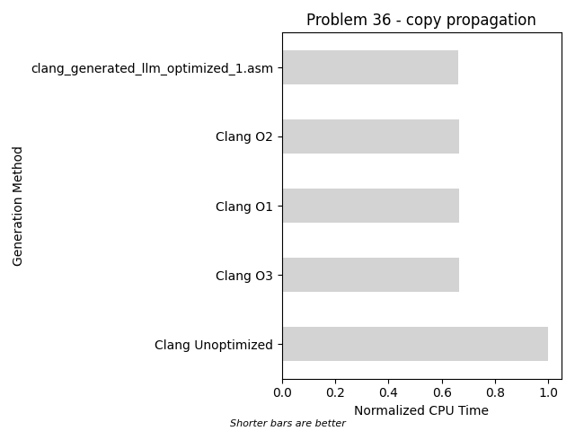

## Problem 37
### Compilation Unit
```c

void customFunction(int int1, int int2, double double1, double double2, int *outInt, double *outDouble) {
    int temp = int1 + 10;
    int a = temp;
    int b = a;
    *outInt = b;
    double tempD = double1 * 1.3;
    double x = tempD;
    double y = x;
    *outDouble = y;
}

```
### Results
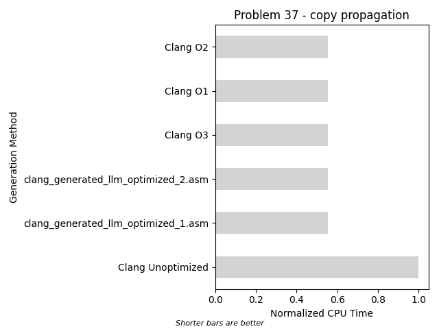

## Problem 38
### Compilation Unit
```c

void customFunction(int int1, int int2, double double1, double double2, int *outInt, double *outDouble) {
    int a = int1 * 6;
    int b = a;
    *outInt = b;
    double x = double1 * 1.5;
    double y = x;
    *outDouble = y;
}

```
### Results
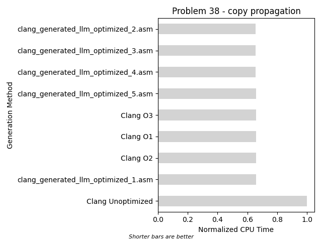

## Problem 39
### Compilation Unit
```c

void customFunction(int int1, int int2, double double1, double double2, int *outInt, double *outDouble) {
    int temp = int1 + 12;
    int a = temp;
    int b = a;
    *outInt = b;
    double tempD = double1 * 1.7;
    double x = tempD;
    double y = x;
    *outDouble = y;
}

```
### Results
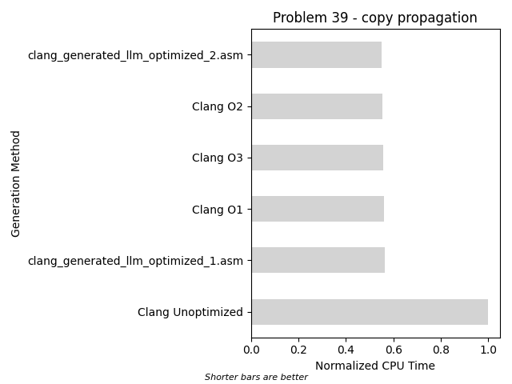

## Problem 40
### Compilation Unit
```c

void customFunction(int int1, int int2, double double1, double double2, int *outInt, double *outDouble) {
    int a = int1 * 9;
    int b = a;
    *outInt = b;
    double x = double1 * 1.9;
    double y = x;
    *outDouble = y;
}

```
### Results
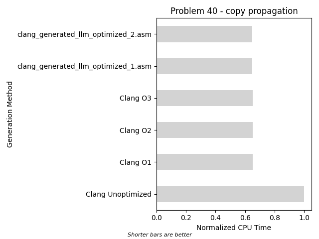

## Problem 41
### Compilation Unit
```c
void customFunction(int int1, int int2, 
                    double double1, double double2, 
                    int *outInt, double *outDouble) {
    if(int1 == 0) {
        *outInt = int2;
        return;
    }
    customFunction(int1-1, int2+1, double1, double2, outInt, outDouble);
}
```
### Results
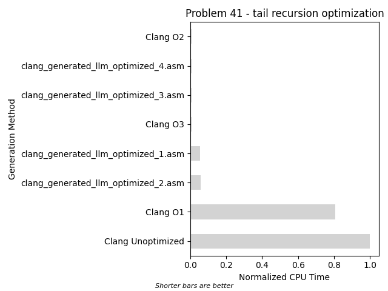

## Problem 42
### Compilation Unit
```c
void customFunction(int int1, int int2, 
                    double double1, double double2, 
                    int *outInt, double *outDouble) {
    if(int1 <= 0) {
        *outDouble = double2;
        return;
    }
    customFunction(int1-2, int2, double1+1, double2, outInt, outDouble);
}
```
### Results
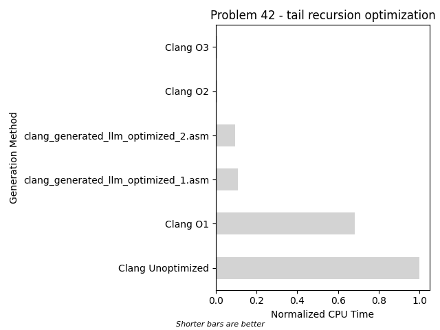

## Problem 43
### Compilation Unit
```c
void customFunction(int int1, int int2, 
                    double double1, double double2, 
                    int *outInt, double *outDouble) {
    if(double1 >= 10.0) {
        *outInt = int1 + int2;
        return;
    }
    customFunction(int1, int2+1, double1+2, double2, outInt, outDouble);
}
```
### Results
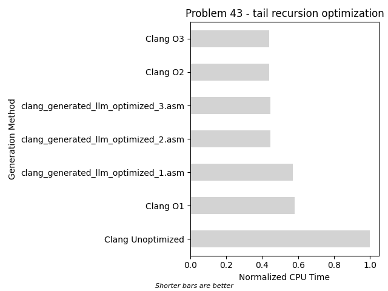

## Problem 44
### Compilation Unit
```c
void customFunction(int int1, int int2, 
                    double double1, double double2, 
                    int *outInt, double *outDouble) {
    if(int1 < 10) {
        *outInt = int2 * 2;
        return;
    }
    customFunction(int1 - 10, int1 + int2, double1, double2, outInt, outDouble);
}
```
### Results
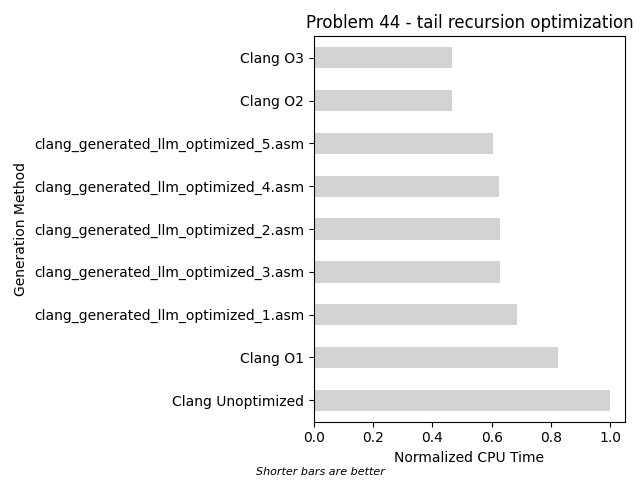

## Problem 45
### Compilation Unit
```c
void customFunction(int int1, int int2, 
                    double double1, double double2, 
                    int *outInt, double *outDouble) {
    if(double1 > 50.0) {
        *outDouble = double2 + 5;
        return;
    }
    customFunction(int2, int1, double1 + double2, double1, outInt, outDouble);
}
```
### Results
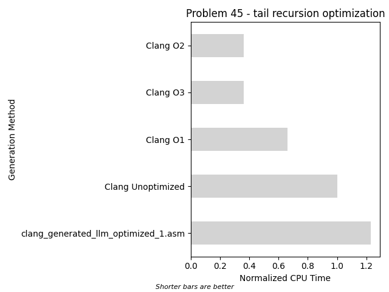

## Problem 46
### Compilation Unit
```c
void customFunction(int int1, int int2, 
                    double double1, double double2, 
                    int *outInt, double *outDouble) {
    double temp = double1 * 2;
    int sum = int1 + int2;
    if(sum < 20) {
        *outInt = sum * 3;
        return;
    }
    customFunction(int2, sum, temp, double2 + 1, outInt, outDouble);
}
```
### Results


## Problem 48
### Compilation Unit
```c
void customFunction(int int1, int int2, 
                    double double1, double double2, 
                    int *outInt, double *outDouble) {
    if(int2 < 0) {
        *outInt = int1;
        return;
    }
    if(int2 % 2 == 0) {
        customFunction(int1 + 3, int2 - 2, double1, double2, outInt, outDouble);
    } else {
        customFunction(int1 + 4, int2 - 1, double1, double2, outInt, outDouble);
    }
}
```
### Results
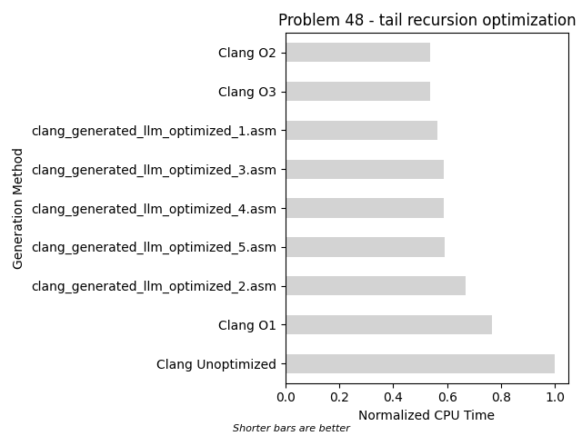

## Problem 49
### Compilation Unit
```c
void customFunction(int int1, int int2, 
                    double double1, double double2, 
                    int *outInt, double *outDouble) {
    if(double2 > 50.0) {
        *outDouble = double1;
        return;
    }
    if(double2 < 10.0) {
        customFunction(int1, int2 + 1, double1 + 2, double2 + 5, outInt, outDouble);
    } else {
        customFunction(int1, int2 + 2, double1 - 2, double2 + 10, outInt, outDouble);
    }
}
```
### Results
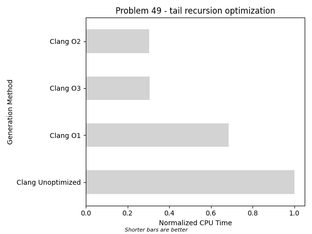

## Problem 50
### Compilation Unit
```c
void customFunction(int int1, int int2, 
                    double double1, double double2, 
                    int *outInt, double *outDouble) {
    if(int1 == 100) {
        *outInt = int2;
        return;
    }
    if(int1 < int2) {
        customFunction(int1 + 5, int2 - 5, double1, double2, outInt, outDouble);
    } else {
        customFunction(int1 - 5, int2 + 5, double1, double2, outInt, outDouble);
    }
}
```
### Results
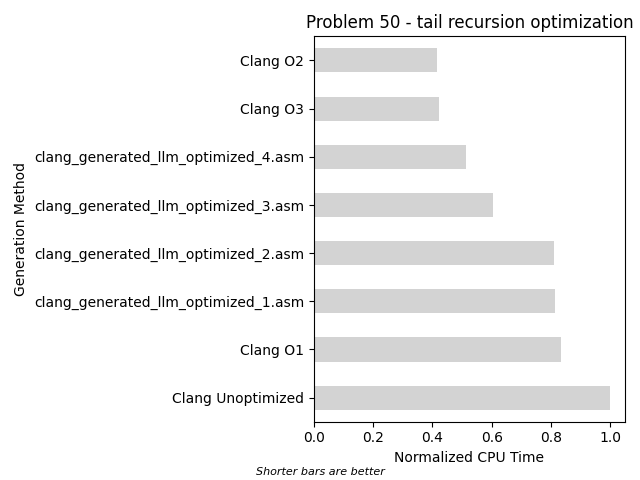

