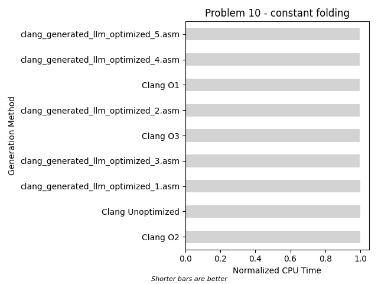
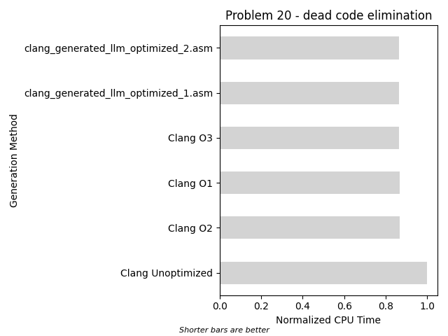
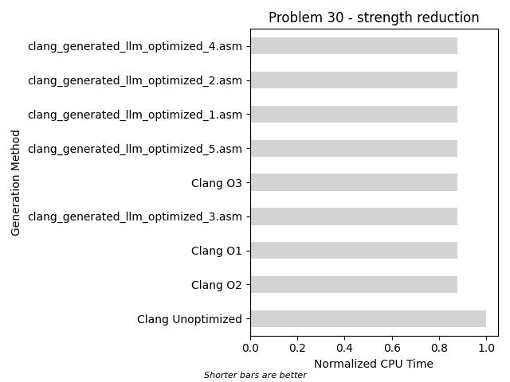
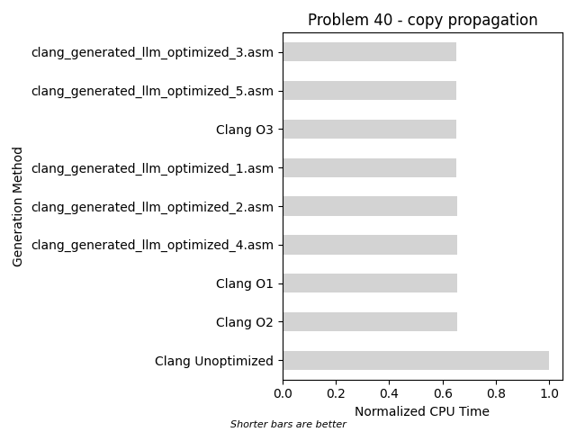
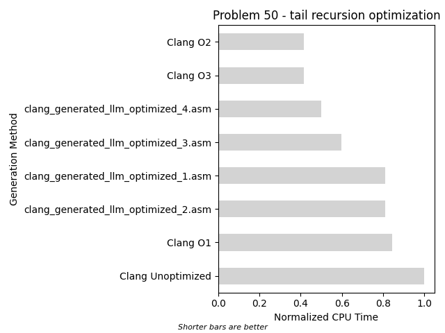

## Problem 10
### Compilation Unit
```c

void customFunction(int int1, int int2, 
                    double double1, double double2, 
                    int *outInt, double *outDouble) {
    *outInt = int1 - (5 + 3 - 2) + int2;
}

```
### Results


## Problem 20
### Compilation Unit
```c

void customFunction(int int1, int int2, 
                    double double1, double double2, 
                    int *outInt, double *outDouble) {
    if (int1 > int2 && int1 < int2) {
        *outInt = int1 - int2;
    }
    *outDouble = double1 + double2;
}

```
### Results


## Problem 30
### Compilation Unit
```c

void customFunction(int int1, int int2, double double1, double double2, int *outInt, double *outDouble) {
    *outInt = (int1 * 6) * 0.5;
    *outDouble = (double1 * 8) * 0.25;
}

```
### Results


## Problem 40
### Compilation Unit
```c

void customFunction(int int1, int int2, double double1, double double2, int *outInt, double *outDouble) {
    int a = int1 * 9;
    int b = a;
    *outInt = b;
    double x = double1 * 1.9;
    double y = x;
    *outDouble = y;
}

```
### Results


## Problem 50
### Compilation Unit
```c
void customFunction(int int1, int int2, 
                    double double1, double double2, 
                    int *outInt, double *outDouble) {
    if(int1 == 100) {
        *outInt = int2;
        return;
    }
    if(int1 < int2) {
        customFunction(int1 + 5, int2 - 5, double1, double2, outInt, outDouble);
    } else {
        customFunction(int1 - 5, int2 + 5, double1, double2, outInt, outDouble);
    }
}
```
### Results


