## Problem 01
### Compilation Unit
```c

void customFunction(int int1, int int2, 
                    double double1, double double2, 
                    int *outInt, double *outDouble) {
    *outInt = int1 * 1 + 0;
    *outDouble = double1 * 1.0 + 0.0;
}
    
```
- Generated Assembly: [Clang O1](../problems/01/generated/clang_generated_O1_optimized.asm), [Clang O2](../problems/01/generated/clang_generated_O2_optimized.asm), [Clang O3](../problems/01/generated/clang_generated_O3_optimized.asm), **[Clang LLM optimized](../problems/01/generated/clang_generated_llm_optimized.asm)**, [Clang Unoptimized](../problems/01/generated/clang_generated_unoptimized.asm), **[LLM generated](../problems/01/generated/llm_generated.asm)**
### Results


## Problem 02
### Compilation Unit
```c

void customFunction(int int1, int int2, 
                    double double1, double double2, 
                    int *outInt, double *outDouble) {
    *outInt = int1 / 1;
    *outDouble = double1 / 1.0;
}
    
```
- Generated Assembly: [Clang O1](../problems/02/generated/clang_generated_O1_optimized.asm), [Clang O2](../problems/02/generated/clang_generated_O2_optimized.asm), [Clang O3](../problems/02/generated/clang_generated_O3_optimized.asm), **[Clang LLM optimized](../problems/02/generated/clang_generated_llm_optimized.asm)**, [Clang Unoptimized](../problems/02/generated/clang_generated_unoptimized.asm), **[LLM generated](../problems/02/generated/llm_generated.asm)**
### Results
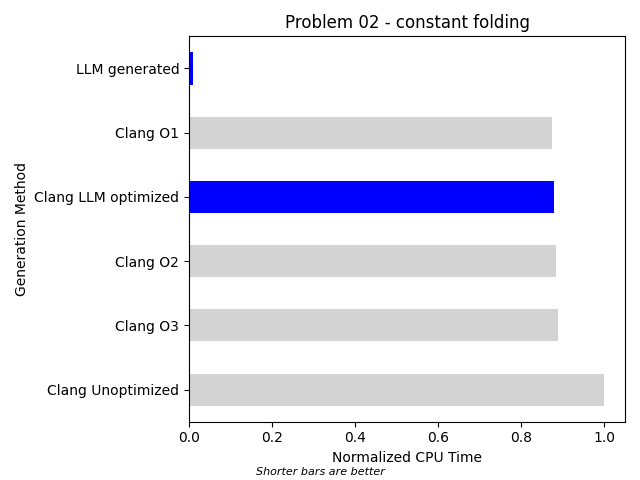

## Problem 03
### Compilation Unit
```c

void customFunction(int int1, int int2, 
                    double double1, double double2, 
                    int *outInt, double *outDouble) {
    *outInt = int1 * 0;
    *outDouble = double1 * 0.0;
}
    
```
- Generated Assembly: [Clang O1](../problems/03/generated/clang_generated_O1_optimized.asm), [Clang O2](../problems/03/generated/clang_generated_O2_optimized.asm), [Clang O3](../problems/03/generated/clang_generated_O3_optimized.asm), **[Clang LLM optimized](../problems/03/generated/clang_generated_llm_optimized.asm)**, [Clang Unoptimized](../problems/03/generated/clang_generated_unoptimized.asm), **[LLM generated](../problems/03/generated/llm_generated.asm)**
### Results
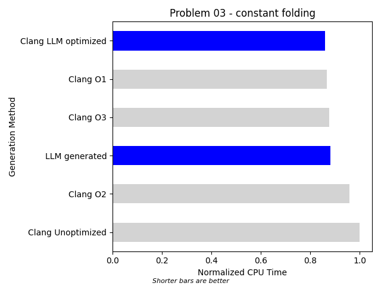

## Problem 04
### Compilation Unit
```c

void customFunction(int int1, int int2, 
                    double double1, double double2, 
                    int *outInt, double *outDouble) {
    *outInt = (int1 + int2 * 0) * 2;
    *outDouble = (double1 - double2 * 0.0) * 2.0;
}
    
```
- Generated Assembly: [Clang O1](../problems/04/generated/clang_generated_O1_optimized.asm), [Clang O2](../problems/04/generated/clang_generated_O2_optimized.asm), [Clang O3](../problems/04/generated/clang_generated_O3_optimized.asm), **[Clang LLM optimized](../problems/04/generated/clang_generated_llm_optimized.asm)**, [Clang Unoptimized](../problems/04/generated/clang_generated_unoptimized.asm), **[LLM generated](../problems/04/generated/llm_generated.asm)**
### Results
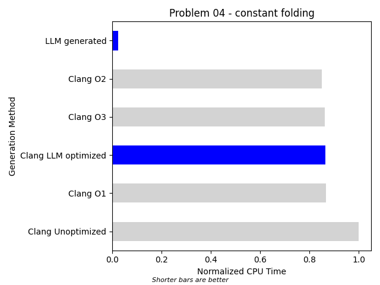

## Problem 05
### Compilation Unit
```c

static int power(int base, int exp) {
    int result = 1;
    for(int i = 0; i < exp; i++) {
        result *= base;
    }
    return result;
}

void customFunction(int int1, int int2, 
                    double double1, double double2, 
                    int *outInt, double *outDouble) {
    *outInt = power(int1, 1);
    *outDouble = power(double1, 0);
}
    
```
- Generated Assembly: [Clang O1](../problems/05/generated/clang_generated_O1_optimized.asm), [Clang O2](../problems/05/generated/clang_generated_O2_optimized.asm), [Clang O3](../problems/05/generated/clang_generated_O3_optimized.asm), **[Clang LLM optimized](../problems/05/generated/clang_generated_llm_optimized.asm)**, [Clang Unoptimized](../problems/05/generated/clang_generated_unoptimized.asm), **[LLM generated](../problems/05/generated/llm_generated.asm)**
### Results
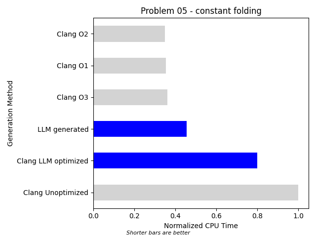

## Problem 06
### Compilation Unit
```c

void customFunction(int int1, int int2, 
                    double double1, double double2, 
                    int *outInt, double *outDouble) {
    int product = int1 * int2;
    *outInt = product + product;
    *outDouble = double1 + double2;
}
    
```
- Generated Assembly: [Clang O1](../problems/06/generated/clang_generated_O1_optimized.asm), [Clang O2](../problems/06/generated/clang_generated_O2_optimized.asm), [Clang O3](../problems/06/generated/clang_generated_O3_optimized.asm), **[Clang LLM optimized](../problems/06/generated/clang_generated_llm_optimized.asm)**, [Clang Unoptimized](../problems/06/generated/clang_generated_unoptimized.asm), **[LLM generated](../problems/06/generated/llm_generated.asm)**
### Results
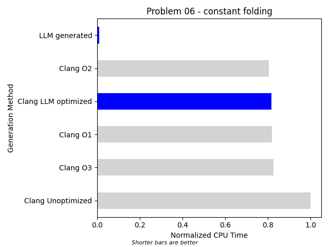

## Problem 07
### Compilation Unit
```c

void customFunction(int int1, int int2, 
                    double double1, double double2, 
                    int *outInt, double *outDouble) {
    *outInt = (int1 * int2) + 0;
    *outDouble = double1 * double2;
}
    
```
- Generated Assembly: [Clang O1](../problems/07/generated/clang_generated_O1_optimized.asm), [Clang O2](../problems/07/generated/clang_generated_O2_optimized.asm), [Clang O3](../problems/07/generated/clang_generated_O3_optimized.asm), **[Clang LLM optimized](../problems/07/generated/clang_generated_llm_optimized.asm)**, [Clang Unoptimized](../problems/07/generated/clang_generated_unoptimized.asm), **[LLM generated](../problems/07/generated/llm_generated.asm)**
### Results
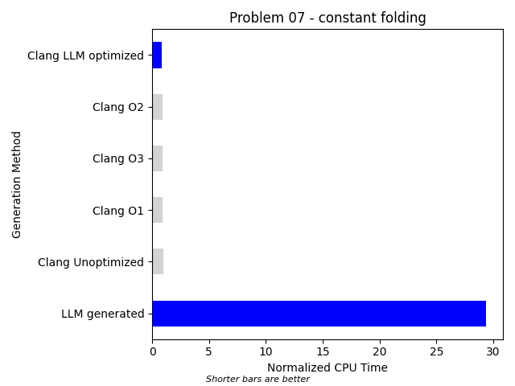

## Problem 08
### Compilation Unit
```c

void customFunction(int int1, int int2, 
                    double double1, double double2, 
                    int *outInt, double *outDouble) {
    *outInt = (int1 * 2) / 2;
    *outDouble = double1 * double2;
}
    
```
- Generated Assembly: [Clang O1](../problems/08/generated/clang_generated_O1_optimized.asm), [Clang O2](../problems/08/generated/clang_generated_O2_optimized.asm), [Clang O3](../problems/08/generated/clang_generated_O3_optimized.asm), **[Clang LLM optimized](../problems/08/generated/clang_generated_llm_optimized.asm)**, [Clang Unoptimized](../problems/08/generated/clang_generated_unoptimized.asm), **[LLM generated](../problems/08/generated/llm_generated.asm)**
### Results
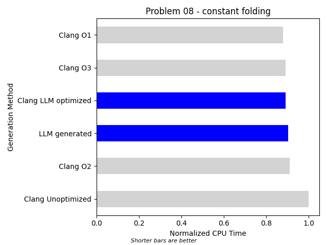

## Problem 09
### Compilation Unit
```c

void customFunction(int int1, int int2, 
                    double double1, double double2, 
                    int *outInt, double *outDouble) {
    int sum1 = int1 + int2;
    int sum2 = int1 + int2;
    *outInt = sum1 - sum2;
    *outDouble = double1 * double2;
}
    
```
- Generated Assembly: [Clang O1](../problems/09/generated/clang_generated_O1_optimized.asm), [Clang O2](../problems/09/generated/clang_generated_O2_optimized.asm), [Clang O3](../problems/09/generated/clang_generated_O3_optimized.asm), **[Clang LLM optimized](../problems/09/generated/clang_generated_llm_optimized.asm)**, [Clang Unoptimized](../problems/09/generated/clang_generated_unoptimized.asm), **[LLM generated](../problems/09/generated/llm_generated.asm)**
### Results
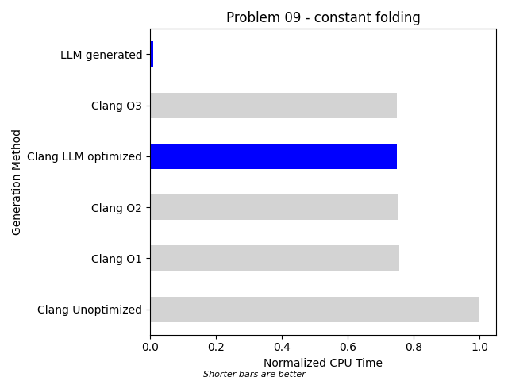

## Problem 10
### Compilation Unit
```c

void customFunction(int int1, int int2, 
                    double double1, double double2, 
                    int *outInt, double *outDouble) {
    *outInt = ((int1 + int2) * 0) + int2;
    *outDouble = (double1 + double2) * (double1 - double2);
}
    
```
- Generated Assembly: [Clang O1](../problems/10/generated/clang_generated_O1_optimized.asm), [Clang O2](../problems/10/generated/clang_generated_O2_optimized.asm), [Clang O3](../problems/10/generated/clang_generated_O3_optimized.asm), **[Clang LLM optimized](../problems/10/generated/clang_generated_llm_optimized.asm)**, [Clang Unoptimized](../problems/10/generated/clang_generated_unoptimized.asm), **[LLM generated](../problems/10/generated/llm_generated.asm)**
### Results
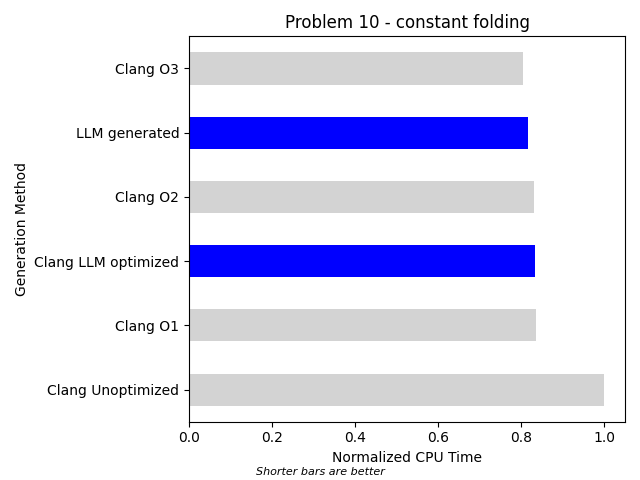

## Problem 100
### Compilation Unit
```c

void customFunction(int int1, int int2, double double1, double double2, int *outInt, double *outDouble) {
    int a = int2 * 10;
    int b = a;
    *outInt = b;
    double x = double2 * 2.0;
    double y = x;
    *outDouble = y;
}

```
- Generated Assembly: [Clang O1](../problems/100/generated/clang_generated_O1_optimized.asm), [Clang O2](../problems/100/generated/clang_generated_O2_optimized.asm), [Clang O3](../problems/100/generated/clang_generated_O3_optimized.asm), **[Clang LLM optimized](../problems/100/generated/clang_generated_llm_optimized.asm)**, [Clang Unoptimized](../problems/100/generated/clang_generated_unoptimized.asm), **[LLM generated](../problems/100/generated/llm_generated.asm)**
### Results
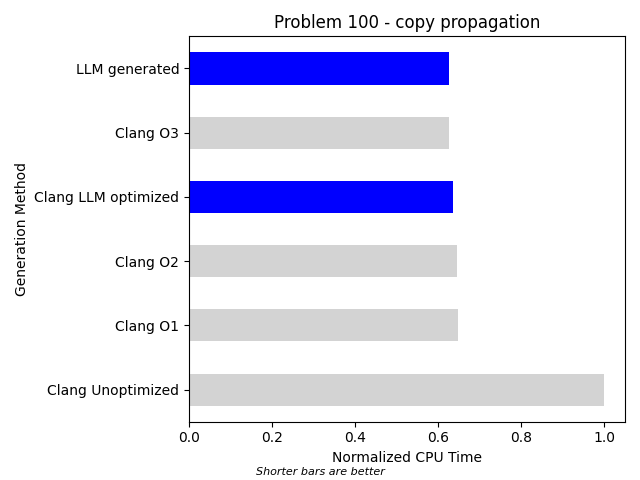

## Problem 11
### Compilation Unit
```c

void customFunction(int int1, int int2, 
                    double double1, double double2, 
                    int *outInt, double *outDouble) {
    *outInt = (int1 + 10 - 5) * (int2 + 5 - 2);
}

```
- Generated Assembly: [Clang O1](../problems/11/generated/clang_generated_O1_optimized.asm), [Clang O2](../problems/11/generated/clang_generated_O2_optimized.asm), [Clang O3](../problems/11/generated/clang_generated_O3_optimized.asm), **[Clang LLM optimized](../problems/11/generated/clang_generated_llm_optimized.asm)**, [Clang Unoptimized](../problems/11/generated/clang_generated_unoptimized.asm), **[LLM generated](../problems/11/generated/llm_generated.asm)**
### Results
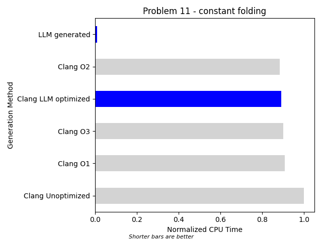

## Problem 12
### Compilation Unit
```c

void customFunction(int int1, int int2, 
                    double double1, double double2, 
                    int *outInt, double *outDouble) {
    double temp = double1 + 1.1;
    *outDouble = temp + double2 - 0.1;
}

```
- Generated Assembly: [Clang O1](../problems/12/generated/clang_generated_O1_optimized.asm), [Clang O2](../problems/12/generated/clang_generated_O2_optimized.asm), [Clang O3](../problems/12/generated/clang_generated_O3_optimized.asm), **[Clang LLM optimized](../problems/12/generated/clang_generated_llm_optimized.asm)**, [Clang Unoptimized](../problems/12/generated/clang_generated_unoptimized.asm), **[LLM generated](../problems/12/generated/llm_generated.asm)**
### Results
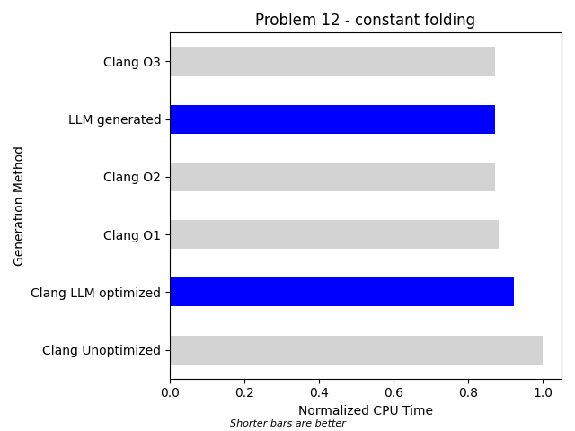

## Problem 13
### Compilation Unit
```c

void customFunction(int int1, int int2, 
                    double double1, double double2, 
                    int *outInt, double *outDouble) {
    int part1 = int1 * int2 + int1 - int2;
    int part2 = int1 * int2 - int1 + int2;
    *outInt = part1 + part2 - int1 * int2;
    *outDouble = double1 + double2;
}
    
```
- Generated Assembly: [Clang O1](../problems/13/generated/clang_generated_O1_optimized.asm), [Clang O2](../problems/13/generated/clang_generated_O2_optimized.asm), [Clang O3](../problems/13/generated/clang_generated_O3_optimized.asm), **[Clang LLM optimized](../problems/13/generated/clang_generated_llm_optimized.asm)**, [Clang Unoptimized](../problems/13/generated/clang_generated_unoptimized.asm), **[LLM generated](../problems/13/generated/llm_generated.asm)**
### Results
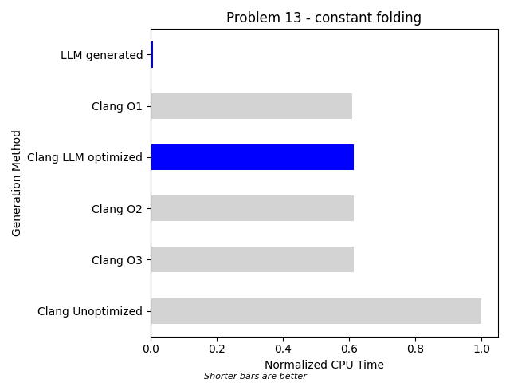

## Problem 14
### Compilation Unit
```c

void customFunction(int int1, int int2, 
                    double double1, double double2, 
                    int *outInt, double *outDouble) {
    int temp1 = int1 + 7;
    double temp2 = double2 - 0.5;
    *outDouble = temp1 + temp2;
}

```
- Generated Assembly: [Clang O1](../problems/14/generated/clang_generated_O1_optimized.asm), [Clang O2](../problems/14/generated/clang_generated_O2_optimized.asm), [Clang O3](../problems/14/generated/clang_generated_O3_optimized.asm), **[Clang LLM optimized](../problems/14/generated/clang_generated_llm_optimized.asm)**, [Clang Unoptimized](../problems/14/generated/clang_generated_unoptimized.asm), **[LLM generated](../problems/14/generated/llm_generated.asm)**
### Results
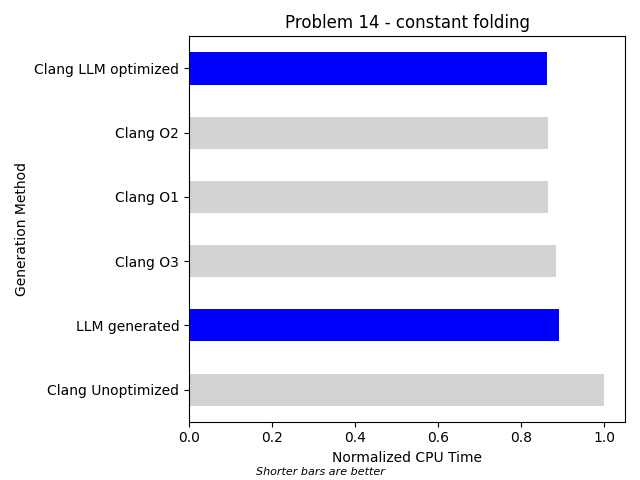

## Problem 15
### Compilation Unit
```c

void customFunction(int int1, int int2, 
                    double double1, double double2, 
                    int *outInt, double *outDouble) {
    int base = int1 * 2 + int2 / 2;
    if (base > 10) {
        *outInt = base + int1 - int2;
    } else {
        *outInt = base - int1 + int2;
    }
    *outDouble = double1 + double2;
}
    
```
- Generated Assembly: [Clang O1](../problems/15/generated/clang_generated_O1_optimized.asm), [Clang O2](../problems/15/generated/clang_generated_O2_optimized.asm), [Clang O3](../problems/15/generated/clang_generated_O3_optimized.asm), **[Clang LLM optimized](../problems/15/generated/clang_generated_llm_optimized.asm)**, [Clang Unoptimized](../problems/15/generated/clang_generated_unoptimized.asm), **[LLM generated](../problems/15/generated/llm_generated.asm)**
### Results
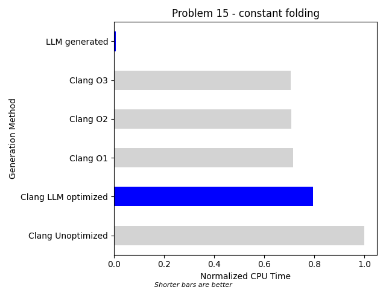

## Problem 16
### Compilation Unit
```c

void customFunction(int int1, int int2, 
                    double double1, double double2, 
                    int *outInt, double *outDouble) {
    *outDouble = (double1 + 2.5 - 1.5) / (double2 + 1.0 - 0.5);
}

```
- Generated Assembly: [Clang O1](../problems/16/generated/clang_generated_O1_optimized.asm), [Clang O2](../problems/16/generated/clang_generated_O2_optimized.asm), [Clang O3](../problems/16/generated/clang_generated_O3_optimized.asm), **[Clang LLM optimized](../problems/16/generated/clang_generated_llm_optimized.asm)**, [Clang Unoptimized](../problems/16/generated/clang_generated_unoptimized.asm), **[LLM generated](../problems/16/generated/llm_generated.asm)**
### Results
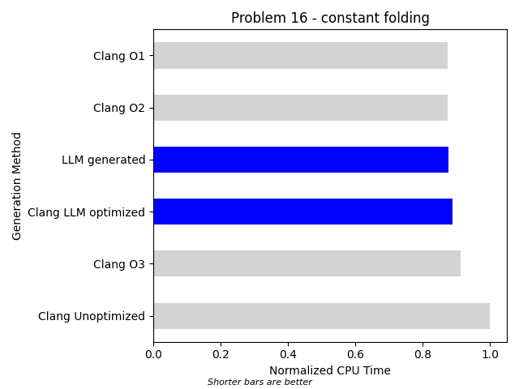

## Problem 17
### Compilation Unit
```c

void customFunction(int int1, int int2, 
                    double double1, double double2, 
                    int *outInt, double *outDouble) {
    int temp = int1 + 4 - 2;
    *outDouble = double2 + temp - 1.0;
}

```
- Generated Assembly: [Clang O1](../problems/17/generated/clang_generated_O1_optimized.asm), [Clang O2](../problems/17/generated/clang_generated_O2_optimized.asm), [Clang O3](../problems/17/generated/clang_generated_O3_optimized.asm), **[Clang LLM optimized](../problems/17/generated/clang_generated_llm_optimized.asm)**, [Clang Unoptimized](../problems/17/generated/clang_generated_unoptimized.asm), **[LLM generated](../problems/17/generated/llm_generated.asm)**
### Results
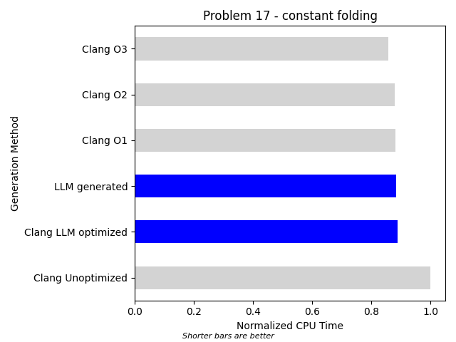

## Problem 18
### Compilation Unit
```c

void customFunction(int int1, int int2, 
                    double double1, double double2, 
                    int *outInt, double *outDouble) {
    *outDouble = double1 * (2.0 + 1.5 - 1.0) + double2;
}

```
- Generated Assembly: [Clang O1](../problems/18/generated/clang_generated_O1_optimized.asm), [Clang O2](../problems/18/generated/clang_generated_O2_optimized.asm), [Clang O3](../problems/18/generated/clang_generated_O3_optimized.asm), **[Clang LLM optimized](../problems/18/generated/clang_generated_llm_optimized.asm)**, [Clang Unoptimized](../problems/18/generated/clang_generated_unoptimized.asm), **[LLM generated](../problems/18/generated/llm_generated.asm)**
### Results
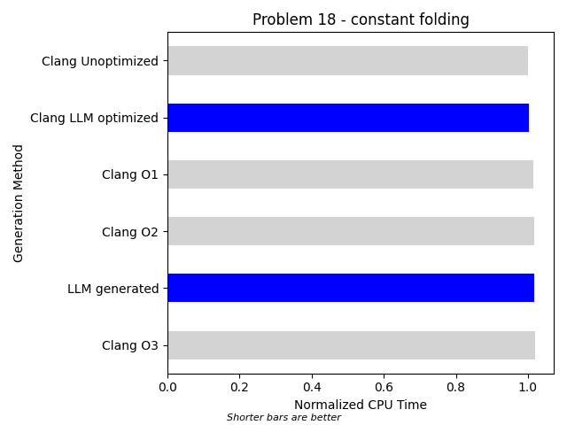

## Problem 19
### Compilation Unit
```c

void customFunction(int int1, int int2, 
                    double double1, double double2, 
                    int *outInt, double *outDouble) {
    *outInt = int1 - (5 + 3 - 2) + int2;
}

```
- Generated Assembly: [Clang O1](../problems/19/generated/clang_generated_O1_optimized.asm), [Clang O2](../problems/19/generated/clang_generated_O2_optimized.asm), [Clang O3](../problems/19/generated/clang_generated_O3_optimized.asm), **[Clang LLM optimized](../problems/19/generated/clang_generated_llm_optimized.asm)**, [Clang Unoptimized](../problems/19/generated/clang_generated_unoptimized.asm), **[LLM generated](../problems/19/generated/llm_generated.asm)**
### Results
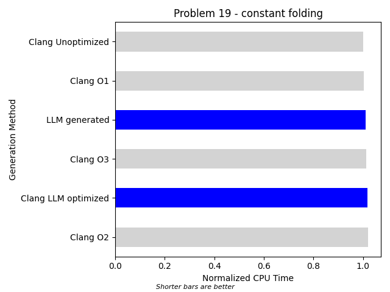

## Problem 20
### Compilation Unit
```c

void customFunction(int int1, int int2, 
                    double double1, double double2, 
                    int *outInt, double *outDouble) {
    int temp1 = int1 + 6 - 3;
    double temp2 = double2 + 1.5 - 0.5;
    *outDouble = temp1 + temp2;
}

```
- Generated Assembly: [Clang O1](../problems/20/generated/clang_generated_O1_optimized.asm), [Clang O2](../problems/20/generated/clang_generated_O2_optimized.asm), [Clang O3](../problems/20/generated/clang_generated_O3_optimized.asm), **[Clang LLM optimized](../problems/20/generated/clang_generated_llm_optimized.asm)**, [Clang Unoptimized](../problems/20/generated/clang_generated_unoptimized.asm), **[LLM generated](../problems/20/generated/llm_generated.asm)**
### Results
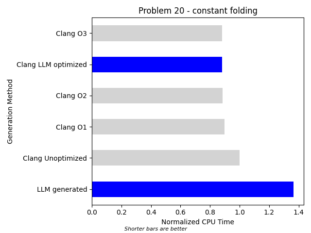

## Problem 21
### Compilation Unit
```c

void customFunction(int int1, int int2, 
					double double1, double double2, 
					int *outInt, double *outDouble) {
    int a = int1;
    a += int2;
    *outInt = int2;
    *outDouble = double1 + double2;
}

```
- Generated Assembly: [Clang O1](../problems/21/generated/clang_generated_O1_optimized.asm), [Clang O2](../problems/21/generated/clang_generated_O2_optimized.asm), [Clang O3](../problems/21/generated/clang_generated_O3_optimized.asm), **[Clang LLM optimized](../problems/21/generated/clang_generated_llm_optimized.asm)**, [Clang Unoptimized](../problems/21/generated/clang_generated_unoptimized.asm), **[LLM generated](../problems/21/generated/llm_generated.asm)**
### Results


## Problem 22
### Compilation Unit
```c

void customFunction(int int1, int int2, 
                    double double1, double double2, 
                    int *outInt, double *outDouble) {
    int unusedVar = 5;
    *outInt = int1 + int2;
    *outDouble = double1 + double2;
}

```
- Generated Assembly: [Clang O1](../problems/22/generated/clang_generated_O1_optimized.asm), [Clang O2](../problems/22/generated/clang_generated_O2_optimized.asm), [Clang O3](../problems/22/generated/clang_generated_O3_optimized.asm), **[Clang LLM optimized](../problems/22/generated/clang_generated_llm_optimized.asm)**, [Clang Unoptimized](../problems/22/generated/clang_generated_unoptimized.asm), **[LLM generated](../problems/22/generated/llm_generated.asm)**
### Results
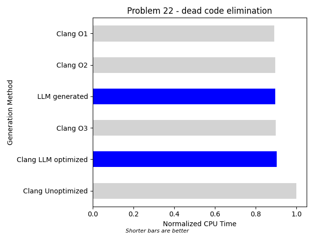

## Problem 23
### Compilation Unit
```c

void customFunction(int int1, int int2, 
					double double1, double double2, 
					int *outInt, double *outDouble) {
    for (int i = 0; i < int1; i++) {
        int tmp = int1 * int2;
    }
    *outInt = int2;
    *outDouble = double1 + double2;
}

```
- Generated Assembly: [Clang O1](../problems/23/generated/clang_generated_O1_optimized.asm), [Clang O2](../problems/23/generated/clang_generated_O2_optimized.asm), [Clang O3](../problems/23/generated/clang_generated_O3_optimized.asm), **[Clang LLM optimized](../problems/23/generated/clang_generated_llm_optimized.asm)**, [Clang Unoptimized](../problems/23/generated/clang_generated_unoptimized.asm), **[LLM generated](../problems/23/generated/llm_generated.asm)**
### Results
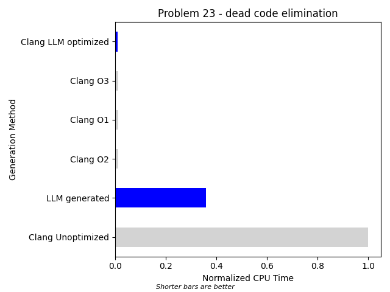

## Problem 24
### Compilation Unit
```c

void customFunction(int int1, int int2, 
					double double1, double double2, 
					int *outInt, double *outDouble) {
    if (int1 > 10) {
        if (int2 < 5) {
            int tmp = int1 - int2;
        }
    } else {
        *outInt = int1 + int2;
    }
    *outDouble = double1 + double2;
}

```
- Generated Assembly: [Clang O1](../problems/24/generated/clang_generated_O1_optimized.asm), [Clang O2](../problems/24/generated/clang_generated_O2_optimized.asm), [Clang O3](../problems/24/generated/clang_generated_O3_optimized.asm), **[Clang LLM optimized](../problems/24/generated/clang_generated_llm_optimized.asm)**, [Clang Unoptimized](../problems/24/generated/clang_generated_unoptimized.asm), **[LLM generated](../problems/24/generated/llm_generated.asm)**
### Results
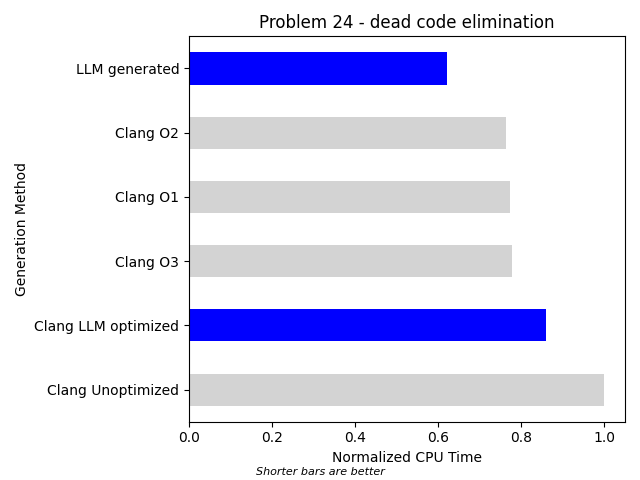

## Problem 25
### Compilation Unit
```c

void customFunction(int int1, int int2, 
					double double1, double double2, 
					int *outInt, double *outDouble) {
    int var1 = int1 * 2;
    int var2 = int2 * 3;
    double var3 = double1 / 2;
    
    *outInt = int1 + int2;
    *outDouble = double1 + double2;
}

```
- Generated Assembly: [Clang O1](../problems/25/generated/clang_generated_O1_optimized.asm), [Clang O2](../problems/25/generated/clang_generated_O2_optimized.asm), [Clang O3](../problems/25/generated/clang_generated_O3_optimized.asm), **[Clang LLM optimized](../problems/25/generated/clang_generated_llm_optimized.asm)**, [Clang Unoptimized](../problems/25/generated/clang_generated_unoptimized.asm), **[LLM generated](../problems/25/generated/llm_generated.asm)**
### Results


## Problem 26
### Compilation Unit
```c

void customFunction(int int1, int int2, 
					double double1, double double2, 
					int *outInt, double *outDouble) {
    int tmp = int1 + int2;
    tmp = int1 - int2;
    *outInt = tmp;
    *outDouble = double1 + double2;
}

```
- Generated Assembly: [Clang O1](../problems/26/generated/clang_generated_O1_optimized.asm), [Clang O2](../problems/26/generated/clang_generated_O2_optimized.asm), [Clang O3](../problems/26/generated/clang_generated_O3_optimized.asm), **[Clang LLM optimized](../problems/26/generated/clang_generated_llm_optimized.asm)**, [Clang Unoptimized](../problems/26/generated/clang_generated_unoptimized.asm), **[LLM generated](../problems/26/generated/llm_generated.asm)**
### Results
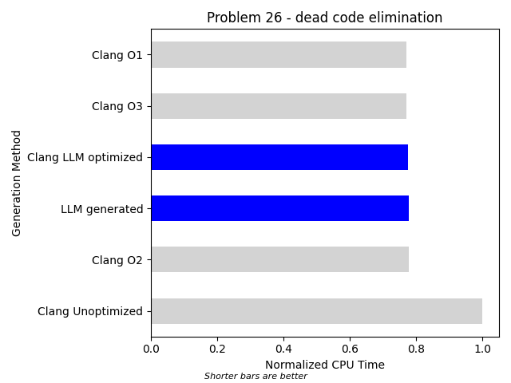

## Problem 27
### Compilation Unit
```c

void customFunction(int int1, int int2, 
                    double double1, double double2, 
                    int *outInt, double *outDouble) {
    if (int1 > 5) {
        *outInt = int1;
        return;
    }
    *outInt = int1 + int2;
    *outDouble = double1 - double2;
}

```
- Generated Assembly: [Clang O1](../problems/27/generated/clang_generated_O1_optimized.asm), [Clang O2](../problems/27/generated/clang_generated_O2_optimized.asm), [Clang O3](../problems/27/generated/clang_generated_O3_optimized.asm), **[Clang LLM optimized](../problems/27/generated/clang_generated_llm_optimized.asm)**, [Clang Unoptimized](../problems/27/generated/clang_generated_unoptimized.asm), **[LLM generated](../problems/27/generated/llm_generated.asm)**
### Results
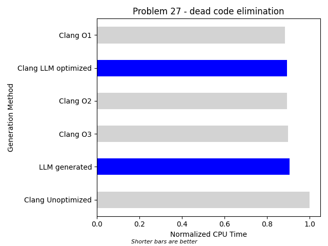

## Problem 28
### Compilation Unit
```c

void customFunction(int int1, int int2, 
					double double1, double double2, 
					int *outInt, double *outDouble) {
    *outInt = int1;
    *outInt = int2;
    *outDouble = double1;
    *outDouble = double2;
}

```
- Generated Assembly: [Clang O1](../problems/28/generated/clang_generated_O1_optimized.asm), [Clang O2](../problems/28/generated/clang_generated_O2_optimized.asm), [Clang O3](../problems/28/generated/clang_generated_O3_optimized.asm), **[Clang LLM optimized](../problems/28/generated/clang_generated_llm_optimized.asm)**, [Clang Unoptimized](../problems/28/generated/clang_generated_unoptimized.asm), **[LLM generated](../problems/28/generated/llm_generated.asm)**
### Results
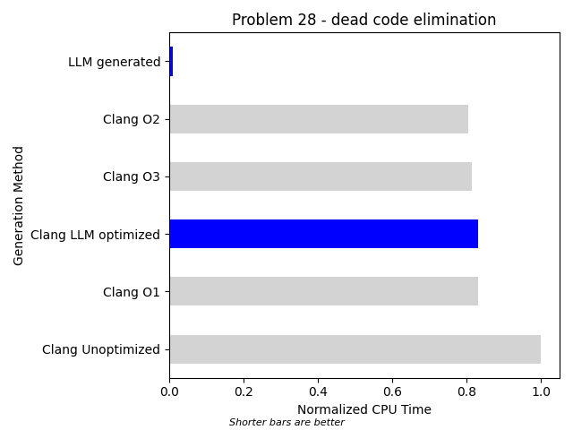

## Problem 29
### Compilation Unit
```c

void customFunction(int int1, int int2, 
                    double double1, double double2, 
                    int *outInt, double *outDouble) {
    if (int1 && !int1) {
        *outInt = int1 - int2; // This will never be executed
    }
    *outDouble = double1 + double2;
}

```
- Generated Assembly: [Clang O1](../problems/29/generated/clang_generated_O1_optimized.asm), [Clang O2](../problems/29/generated/clang_generated_O2_optimized.asm), [Clang O3](../problems/29/generated/clang_generated_O3_optimized.asm), **[Clang LLM optimized](../problems/29/generated/clang_generated_llm_optimized.asm)**, [Clang Unoptimized](../problems/29/generated/clang_generated_unoptimized.asm), **[LLM generated](../problems/29/generated/llm_generated.asm)**
### Results
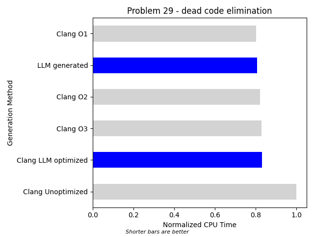

## Problem 30
### Compilation Unit
```c

void customFunction(int int1, int int2, 
					double double1, double double2, 
					int *outInt, double *outDouble) {
    if (int1 > int2) {
        *outInt = int1 + int2;
    } else {
        *outInt = int1 + int2;
    }
    *outDouble = double1 + double2;
}

```
- Generated Assembly: [Clang O1](../problems/30/generated/clang_generated_O1_optimized.asm), [Clang O2](../problems/30/generated/clang_generated_O2_optimized.asm), [Clang O3](../problems/30/generated/clang_generated_O3_optimized.asm), **[Clang LLM optimized](../problems/30/generated/clang_generated_llm_optimized.asm)**, [Clang Unoptimized](../problems/30/generated/clang_generated_unoptimized.asm), **[LLM generated](../problems/30/generated/llm_generated.asm)**
### Results
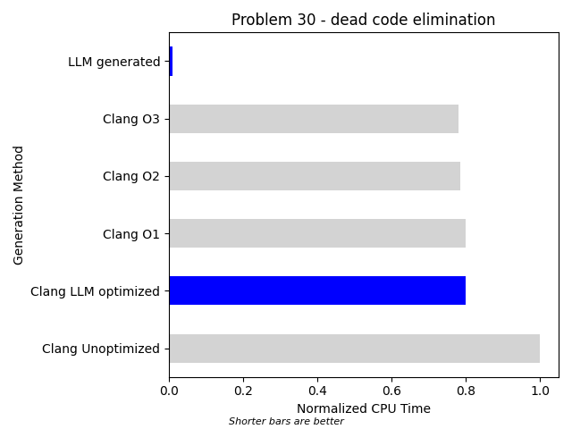

## Problem 31
### Compilation Unit
```c

void customFunction(int int1, int int2, 
					double double1, double double2, 
					int *outInt, double *outDouble) {
    int tmp1 = int1 * 2;
    int tmp2 = int2 - 5;
    int tmp3 = int1 + int2;
    *outInt = tmp3;
    double tmpDouble1 = double1 / 2;
    double tmpDouble2 = double2 * 3;
    *outDouble = double1 + double2;
}

```
- Generated Assembly: [Clang O1](../problems/31/generated/clang_generated_O1_optimized.asm), [Clang O2](../problems/31/generated/clang_generated_O2_optimized.asm), [Clang O3](../problems/31/generated/clang_generated_O3_optimized.asm), **[Clang LLM optimized](../problems/31/generated/clang_generated_llm_optimized.asm)**, [Clang Unoptimized](../problems/31/generated/clang_generated_unoptimized.asm), **[LLM generated](../problems/31/generated/llm_generated.asm)**
### Results
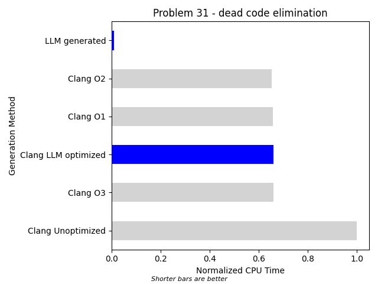

## Problem 32
### Compilation Unit
```c

void customFunction(int int1, int int2, 
					double double1, double double2, 
					int *outInt, double *outDouble) {
    for (int i = 0; i < int1; i++) {
        *outInt = int1 * int2;
    }
    *outInt = int1 + int2;
    for (int j = 0; j < int2; j++) {
        double tmp = double1 * 2;
    }
    *outDouble = double1 + double2;
}

```
- Generated Assembly: [Clang O1](../problems/32/generated/clang_generated_O1_optimized.asm), [Clang O2](../problems/32/generated/clang_generated_O2_optimized.asm), [Clang O3](../problems/32/generated/clang_generated_O3_optimized.asm), **[Clang LLM optimized](../problems/32/generated/clang_generated_llm_optimized.asm)**, [Clang Unoptimized](../problems/32/generated/clang_generated_unoptimized.asm), **[LLM generated](../problems/32/generated/llm_generated.asm)**
### Results


## Problem 33
### Compilation Unit
```c

void customFunction(int int1, int int2, 
                    double double1, double double2, 
                    int *outInt, double *outDouble) {
    *outInt = int1;
    *outInt = int2;
    *outDouble = double1 + double2;
}

```
- Generated Assembly: [Clang O1](../problems/33/generated/clang_generated_O1_optimized.asm), [Clang O2](../problems/33/generated/clang_generated_O2_optimized.asm), [Clang O3](../problems/33/generated/clang_generated_O3_optimized.asm), **[Clang LLM optimized](../problems/33/generated/clang_generated_llm_optimized.asm)**, [Clang Unoptimized](../problems/33/generated/clang_generated_unoptimized.asm), **[LLM generated](../problems/33/generated/llm_generated.asm)**
### Results
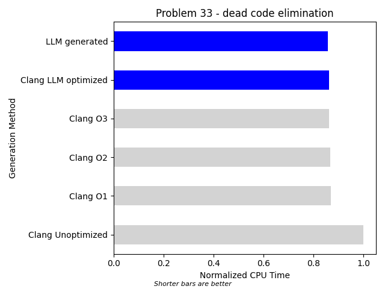

## Problem 34
### Compilation Unit
```c

void customFunction(int int1, int int2, 
                    double double1, double double2, 
                    int *outInt, double *outDouble) {
    *outInt = int1 * 1; 
    *outDouble = double1 + double2 + 0;
}

```
- Generated Assembly: [Clang O1](../problems/34/generated/clang_generated_O1_optimized.asm), [Clang O2](../problems/34/generated/clang_generated_O2_optimized.asm), [Clang O3](../problems/34/generated/clang_generated_O3_optimized.asm), **[Clang LLM optimized](../problems/34/generated/clang_generated_llm_optimized.asm)**, [Clang Unoptimized](../problems/34/generated/clang_generated_unoptimized.asm), **[LLM generated](../problems/34/generated/llm_generated.asm)**
### Results
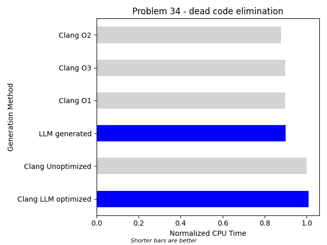

## Problem 35
### Compilation Unit
```c

void customFunction(int int1, int int2, 
					double double1, double double2, 
					int *outInt, double *outDouble) {
    *outInt = int1;
    for (int i = 0; i < int1; i++) {
        if (i % 2 == 0) {
            *outInt = int1 + int2;
        }
    }
    *outInt = int1 - int2;
    *outDouble = double1 + double2;
}

```
- Generated Assembly: [Clang O1](../problems/35/generated/clang_generated_O1_optimized.asm), [Clang O2](../problems/35/generated/clang_generated_O2_optimized.asm), [Clang O3](../problems/35/generated/clang_generated_O3_optimized.asm), **[Clang LLM optimized](../problems/35/generated/clang_generated_llm_optimized.asm)**, [Clang Unoptimized](../problems/35/generated/clang_generated_unoptimized.asm), **[LLM generated](../problems/35/generated/llm_generated.asm)**
### Results
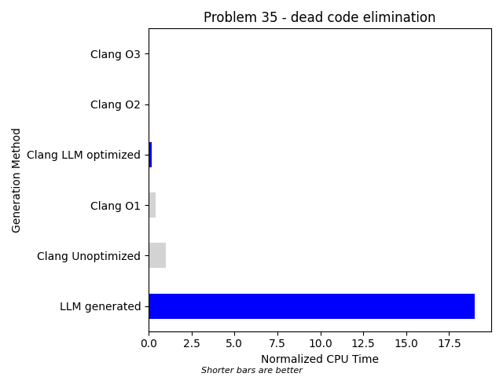

## Problem 36
### Compilation Unit
```c

void customFunction(int int1, int int2, 
                    double double1, double double2, 
                    int *outInt, double *outDouble) {
    *outInt = int1 + 0;
    *outDouble = double1 * 1.0;
}

```
- Generated Assembly: [Clang O1](../problems/36/generated/clang_generated_O1_optimized.asm), [Clang O2](../problems/36/generated/clang_generated_O2_optimized.asm), [Clang O3](../problems/36/generated/clang_generated_O3_optimized.asm), **[Clang LLM optimized](../problems/36/generated/clang_generated_llm_optimized.asm)**, [Clang Unoptimized](../problems/36/generated/clang_generated_unoptimized.asm), **[LLM generated](../problems/36/generated/llm_generated.asm)**
### Results
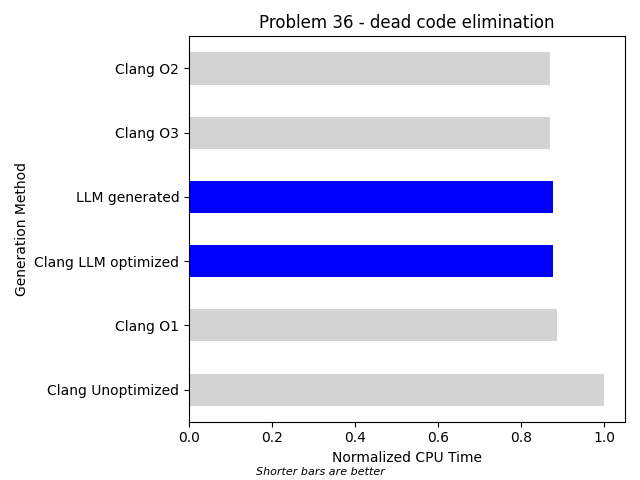

## Problem 37
### Compilation Unit
```c

void customFunction(int int1, int int2, 
                    double double1, double double2, 
                    int *outInt, double *outDouble) {
    int temp = int1;
    temp = int2;
    *outInt = temp;
    *outDouble = double1 + double2;
}

```
- Generated Assembly: [Clang O1](../problems/37/generated/clang_generated_O1_optimized.asm), [Clang O2](../problems/37/generated/clang_generated_O2_optimized.asm), [Clang O3](../problems/37/generated/clang_generated_O3_optimized.asm), **[Clang LLM optimized](../problems/37/generated/clang_generated_llm_optimized.asm)**, [Clang Unoptimized](../problems/37/generated/clang_generated_unoptimized.asm), **[LLM generated](../problems/37/generated/llm_generated.asm)**
### Results
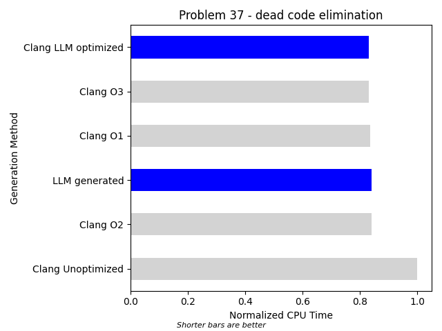

## Problem 38
### Compilation Unit
```c

void customFunction(int int1, int int2, 
                    double double1, double double2, 
                    int *outInt, double *outDouble) {
    *outInt = int1 * int2;
    *outInt = int1 + int2;
    *outDouble = double1 + double2;
}

```
- Generated Assembly: [Clang O1](../problems/38/generated/clang_generated_O1_optimized.asm), [Clang O2](../problems/38/generated/clang_generated_O2_optimized.asm), [Clang O3](../problems/38/generated/clang_generated_O3_optimized.asm), **[Clang LLM optimized](../problems/38/generated/clang_generated_llm_optimized.asm)**, [Clang Unoptimized](../problems/38/generated/clang_generated_unoptimized.asm), **[LLM generated](../problems/38/generated/llm_generated.asm)**
### Results
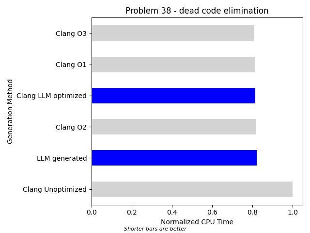

## Problem 39
### Compilation Unit
```c

void customFunction(int int1, int int2, 
                    double double1, double double2, 
                    int *outInt, double *outDouble) {
    if (int1 > int2 && int1 < int2) {
        *outInt = int1 - int2;
    }
    *outDouble = double1 + double2;
}

```
- Generated Assembly: [Clang O1](../problems/39/generated/clang_generated_O1_optimized.asm), [Clang O2](../problems/39/generated/clang_generated_O2_optimized.asm), [Clang O3](../problems/39/generated/clang_generated_O3_optimized.asm), **[Clang LLM optimized](../problems/39/generated/clang_generated_llm_optimized.asm)**, [Clang Unoptimized](../problems/39/generated/clang_generated_unoptimized.asm), **[LLM generated](../problems/39/generated/llm_generated.asm)**
### Results
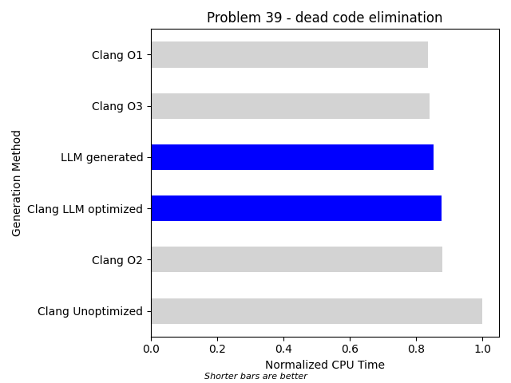

## Problem 40
### Compilation Unit
```c

void customFunction(int int1, int int2, 
                    double double1, double double2, 
                    int *outInt, double *outDouble) {
    int temp = int1;
    temp = int2;
    temp = int1 + int2;
    *outInt = temp;
    *outDouble = double1 + double2;
}

```
- Generated Assembly: [Clang O1](../problems/40/generated/clang_generated_O1_optimized.asm), [Clang O2](../problems/40/generated/clang_generated_O2_optimized.asm), [Clang O3](../problems/40/generated/clang_generated_O3_optimized.asm), **[Clang LLM optimized](../problems/40/generated/clang_generated_llm_optimized.asm)**, [Clang Unoptimized](../problems/40/generated/clang_generated_unoptimized.asm), **[LLM generated](../problems/40/generated/llm_generated.asm)**
### Results
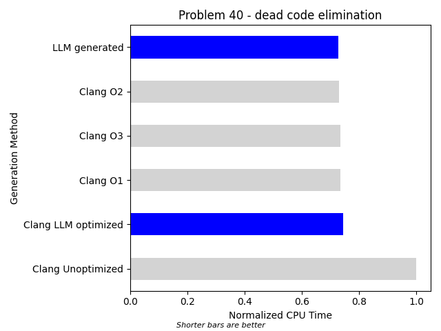

## Problem 41
### Compilation Unit
```c

void customFunction(int int1, int int2, double double1, double double2, int *outInt, double *outDouble) {
    *outInt = int1 * 8;
    *outDouble = double2 * 16.0;
}

```
- Generated Assembly: [Clang O1](../problems/41/generated/clang_generated_O1_optimized.asm), [Clang O2](../problems/41/generated/clang_generated_O2_optimized.asm), [Clang O3](../problems/41/generated/clang_generated_O3_optimized.asm), **[Clang LLM optimized](../problems/41/generated/clang_generated_llm_optimized.asm)**, [Clang Unoptimized](../problems/41/generated/clang_generated_unoptimized.asm), **[LLM generated](../problems/41/generated/llm_generated.asm)**
### Results
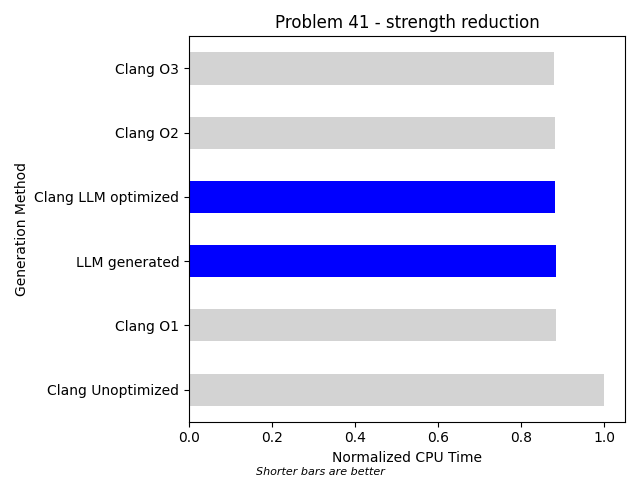

## Problem 42
### Compilation Unit
```c

void customFunction(int int1, int int2, double double1, double double2, int *outInt, double *outDouble) {
    *outInt = int2 / 4;
    *outDouble = double1 / 2.0;
}

```
- Generated Assembly: [Clang O1](../problems/42/generated/clang_generated_O1_optimized.asm), [Clang O2](../problems/42/generated/clang_generated_O2_optimized.asm), [Clang O3](../problems/42/generated/clang_generated_O3_optimized.asm), **[Clang LLM optimized](../problems/42/generated/clang_generated_llm_optimized.asm)**, [Clang Unoptimized](../problems/42/generated/clang_generated_unoptimized.asm), **[LLM generated](../problems/42/generated/llm_generated.asm)**
### Results
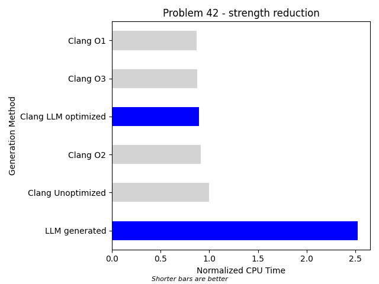

## Problem 43
### Compilation Unit
```c

void customFunction(int int1, int int2, double double1, double double2, int *outInt, double *outDouble) {
    *outInt = int1 + int1 + int1;
    *outDouble = double1 + double1 + double1 + double1;
}

```
- Generated Assembly: [Clang O1](../problems/43/generated/clang_generated_O1_optimized.asm), [Clang O2](../problems/43/generated/clang_generated_O2_optimized.asm), [Clang O3](../problems/43/generated/clang_generated_O3_optimized.asm), **[Clang LLM optimized](../problems/43/generated/clang_generated_llm_optimized.asm)**, [Clang Unoptimized](../problems/43/generated/clang_generated_unoptimized.asm), **[LLM generated](../problems/43/generated/llm_generated.asm)**
### Results
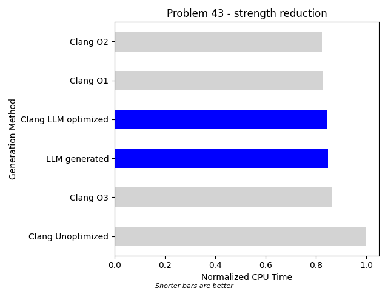

## Problem 44
### Compilation Unit
```c

void customFunction(int int1, int int2, double double1, double double2, int *outInt, double *outDouble) {
    *outInt = int1 * int1;
    *outDouble = double2 * double2;
}

```
- Generated Assembly: [Clang O1](../problems/44/generated/clang_generated_O1_optimized.asm), [Clang O2](../problems/44/generated/clang_generated_O2_optimized.asm), [Clang O3](../problems/44/generated/clang_generated_O3_optimized.asm), **[Clang LLM optimized](../problems/44/generated/clang_generated_llm_optimized.asm)**, [Clang Unoptimized](../problems/44/generated/clang_generated_unoptimized.asm), **[LLM generated](../problems/44/generated/llm_generated.asm)**
### Results
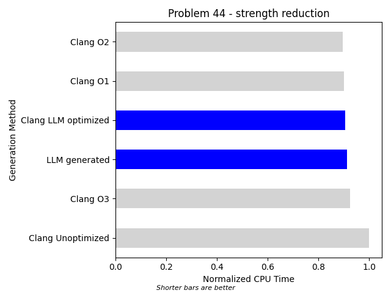

## Problem 45
### Compilation Unit
```c

void customFunction(int int1, int int2, double double1, double double2, int *outInt, double *outDouble) {
    *outInt = int1 + int1 + int1 + int1 + int1;
    *outDouble = double1 + double1 + double1 + double1 + double1 + double1;
}

```
- Generated Assembly: [Clang O1](../problems/45/generated/clang_generated_O1_optimized.asm), [Clang O2](../problems/45/generated/clang_generated_O2_optimized.asm), [Clang O3](../problems/45/generated/clang_generated_O3_optimized.asm), **[Clang LLM optimized](../problems/45/generated/clang_generated_llm_optimized.asm)**, [Clang Unoptimized](../problems/45/generated/clang_generated_unoptimized.asm), **[LLM generated](../problems/45/generated/llm_generated.asm)**
### Results
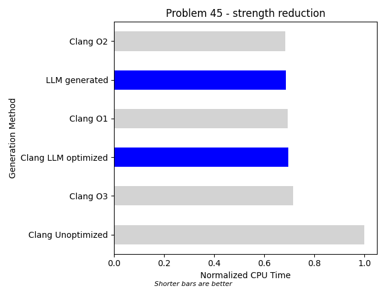

## Problem 46
### Compilation Unit
```c

void customFunction(int int1, int int2, double double1, double double2, int *outInt, double *outDouble) {
    *outInt = int1 * int2 + int1;
    *outDouble = double1 * double2 + double1;
}

```
- Generated Assembly: [Clang O1](../problems/46/generated/clang_generated_O1_optimized.asm), [Clang O2](../problems/46/generated/clang_generated_O2_optimized.asm), [Clang O3](../problems/46/generated/clang_generated_O3_optimized.asm), **[Clang LLM optimized](../problems/46/generated/clang_generated_llm_optimized.asm)**, [Clang Unoptimized](../problems/46/generated/clang_generated_unoptimized.asm), **[LLM generated](../problems/46/generated/llm_generated.asm)**
### Results
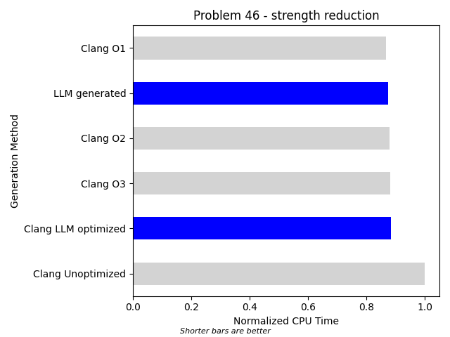

## Problem 47
### Compilation Unit
```c

void customFunction(int int1, int int2, double double1, double double2, int *outInt, double *outDouble) {
    *outInt = int1 * (int2 + 3);
    *outDouble = double1 * (double2 + 1.5);
}

```
- Generated Assembly: [Clang O1](../problems/47/generated/clang_generated_O1_optimized.asm), [Clang O2](../problems/47/generated/clang_generated_O2_optimized.asm), [Clang O3](../problems/47/generated/clang_generated_O3_optimized.asm), **[Clang LLM optimized](../problems/47/generated/clang_generated_llm_optimized.asm)**, [Clang Unoptimized](../problems/47/generated/clang_generated_unoptimized.asm), **[LLM generated](../problems/47/generated/llm_generated.asm)**
### Results
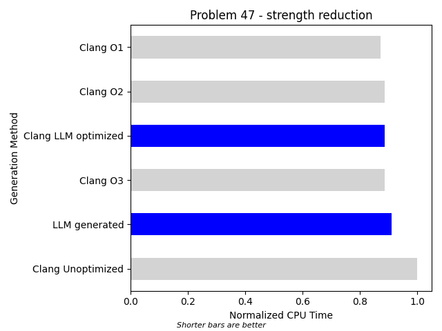

## Problem 48
### Compilation Unit
```c

void customFunction(int int1, int int2, double double1, double double2, int *outInt, double *outDouble) {
    *outInt = int1 * int1 * int1 * int1;
    *outDouble = double1 * double1 * double1 * double1;
}

```
- Generated Assembly: [Clang O1](../problems/48/generated/clang_generated_O1_optimized.asm), [Clang O2](../problems/48/generated/clang_generated_O2_optimized.asm), [Clang O3](../problems/48/generated/clang_generated_O3_optimized.asm), **[Clang LLM optimized](../problems/48/generated/clang_generated_llm_optimized.asm)**, [Clang Unoptimized](../problems/48/generated/clang_generated_unoptimized.asm), **[LLM generated](../problems/48/generated/llm_generated.asm)**
### Results
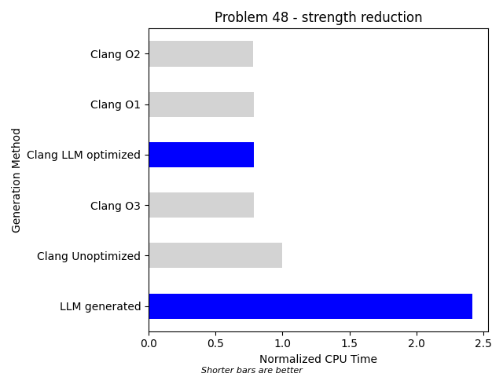

## Problem 49
### Compilation Unit
```c

void customFunction(int int1, int int2, double double1, double double2, int *outInt, double *outDouble) {
    *outInt = int1 + int1;
    *outDouble = double1 + double1;
}

```
- Generated Assembly: [Clang O1](../problems/49/generated/clang_generated_O1_optimized.asm), [Clang O2](../problems/49/generated/clang_generated_O2_optimized.asm), [Clang O3](../problems/49/generated/clang_generated_O3_optimized.asm), **[Clang LLM optimized](../problems/49/generated/clang_generated_llm_optimized.asm)**, [Clang Unoptimized](../problems/49/generated/clang_generated_unoptimized.asm), **[LLM generated](../problems/49/generated/llm_generated.asm)**
### Results
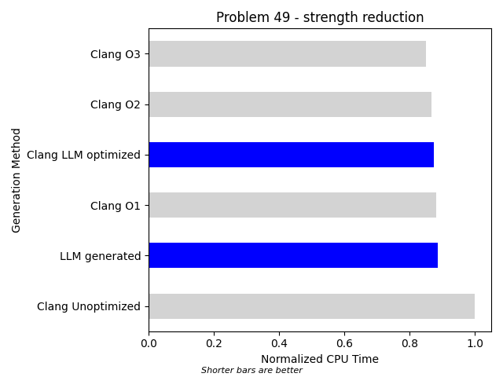

## Problem 50
### Compilation Unit
```c

void customFunction(int int1, int int2, double double1, double double2, int *outInt, double *outDouble) {
    *outInt = int1 * (1/3);
    *outDouble = double1 * 0.25;
}

```
- Generated Assembly: [Clang O1](../problems/50/generated/clang_generated_O1_optimized.asm), [Clang O2](../problems/50/generated/clang_generated_O2_optimized.asm), [Clang O3](../problems/50/generated/clang_generated_O3_optimized.asm), **[Clang LLM optimized](../problems/50/generated/clang_generated_llm_optimized.asm)**, [Clang Unoptimized](../problems/50/generated/clang_generated_unoptimized.asm), **[LLM generated](../problems/50/generated/llm_generated.asm)**
### Results
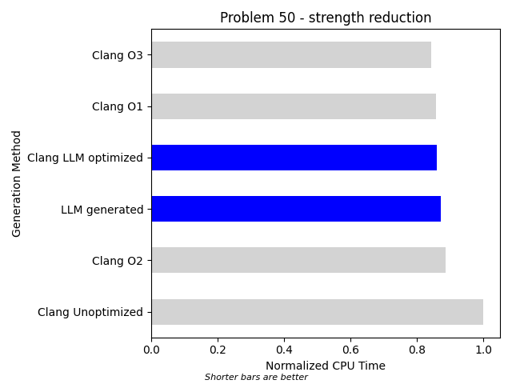

## Problem 51
### Compilation Unit
```c

void customFunction(int int1, int int2, double double1, double double2, int *outInt, double *outDouble) {
    *outInt = int1 * (4 + 4);
    *outDouble = double2 * (8 + 8);
}

```
- Generated Assembly: [Clang O1](../problems/51/generated/clang_generated_O1_optimized.asm), [Clang O2](../problems/51/generated/clang_generated_O2_optimized.asm), [Clang O3](../problems/51/generated/clang_generated_O3_optimized.asm), **[Clang LLM optimized](../problems/51/generated/clang_generated_llm_optimized.asm)**, [Clang Unoptimized](../problems/51/generated/clang_generated_unoptimized.asm), **[LLM generated](../problems/51/generated/llm_generated.asm)**
### Results
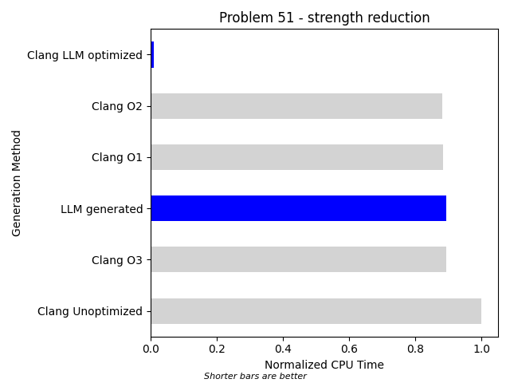

## Problem 52
### Compilation Unit
```c

void customFunction(int int1, int int2, double double1, double double2, int *outInt, double *outDouble) {
    *outInt = (int2 * 8) - int2;
    *outDouble = (double1 * 4) - double1;
}

```
- Generated Assembly: [Clang O1](../problems/52/generated/clang_generated_O1_optimized.asm), [Clang O2](../problems/52/generated/clang_generated_O2_optimized.asm), [Clang O3](../problems/52/generated/clang_generated_O3_optimized.asm), **[Clang LLM optimized](../problems/52/generated/clang_generated_llm_optimized.asm)**, [Clang Unoptimized](../problems/52/generated/clang_generated_unoptimized.asm), **[LLM generated](../problems/52/generated/llm_generated.asm)**
### Results
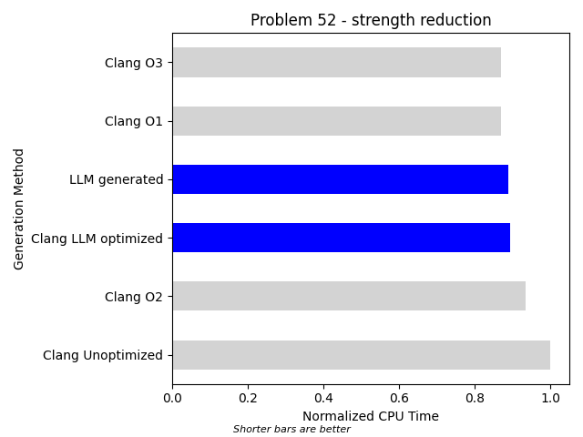

## Problem 53
### Compilation Unit
```c

void customFunction(int int1, int int2, double double1, double double2, int *outInt, double *outDouble) {
    *outInt = (int1 * 7) + int1;
    *outDouble = (double1 * 15) + double1;
}

```
- Generated Assembly: [Clang O1](../problems/53/generated/clang_generated_O1_optimized.asm), [Clang O2](../problems/53/generated/clang_generated_O2_optimized.asm), [Clang O3](../problems/53/generated/clang_generated_O3_optimized.asm), **[Clang LLM optimized](../problems/53/generated/clang_generated_llm_optimized.asm)**, [Clang Unoptimized](../problems/53/generated/clang_generated_unoptimized.asm), **[LLM generated](../problems/53/generated/llm_generated.asm)**
### Results


## Problem 54
### Compilation Unit
```c

void customFunction(int int1, int int2, double double1, double double2, int *outInt, double *outDouble) {
    *outInt = (int1 * 3) + (int1 * 2) + int1;
    *outDouble = (double1 * 4) + (double1 * 3) + double1;
}

```
- Generated Assembly: [Clang O1](../problems/54/generated/clang_generated_O1_optimized.asm), [Clang O2](../problems/54/generated/clang_generated_O2_optimized.asm), [Clang O3](../problems/54/generated/clang_generated_O3_optimized.asm), **[Clang LLM optimized](../problems/54/generated/clang_generated_llm_optimized.asm)**, [Clang Unoptimized](../problems/54/generated/clang_generated_unoptimized.asm), **[LLM generated](../problems/54/generated/llm_generated.asm)**
### Results
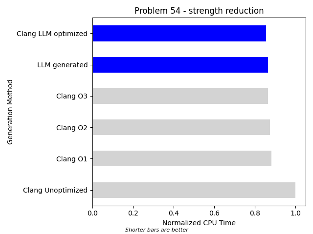

## Problem 55
### Compilation Unit
```c

void customFunction(int int1, int int2, double double1, double double2, int *outInt, double *outDouble) {
    *outInt = (int1 * 4) + int1 + int1;
    *outDouble = (double1 * 5) + double1 + double1 + double1;
}

```
- Generated Assembly: [Clang O1](../problems/55/generated/clang_generated_O1_optimized.asm), [Clang O2](../problems/55/generated/clang_generated_O2_optimized.asm), [Clang O3](../problems/55/generated/clang_generated_O3_optimized.asm), **[Clang LLM optimized](../problems/55/generated/clang_generated_llm_optimized.asm)**, [Clang Unoptimized](../problems/55/generated/clang_generated_unoptimized.asm), **[LLM generated](../problems/55/generated/llm_generated.asm)**
### Results
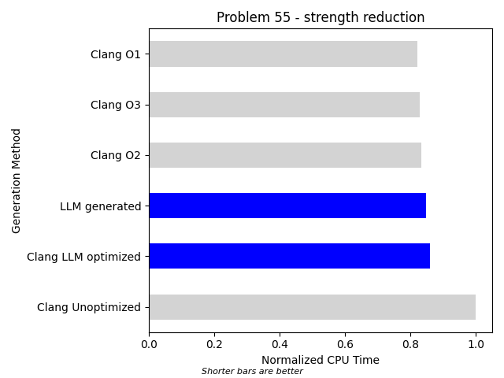

## Problem 56
### Compilation Unit
```c

void customFunction(int int1, int int2, double double1, double double2, int *outInt, double *outDouble) {
    *outInt = (int1 + 2) * (int2 + 3);
    *outDouble = (double1 + 1.0) * (double2 + 2.0);
}

```
- Generated Assembly: [Clang O1](../problems/56/generated/clang_generated_O1_optimized.asm), [Clang O2](../problems/56/generated/clang_generated_O2_optimized.asm), [Clang O3](../problems/56/generated/clang_generated_O3_optimized.asm), **[Clang LLM optimized](../problems/56/generated/clang_generated_llm_optimized.asm)**, [Clang Unoptimized](../problems/56/generated/clang_generated_unoptimized.asm), **[LLM generated](../problems/56/generated/llm_generated.asm)**
### Results
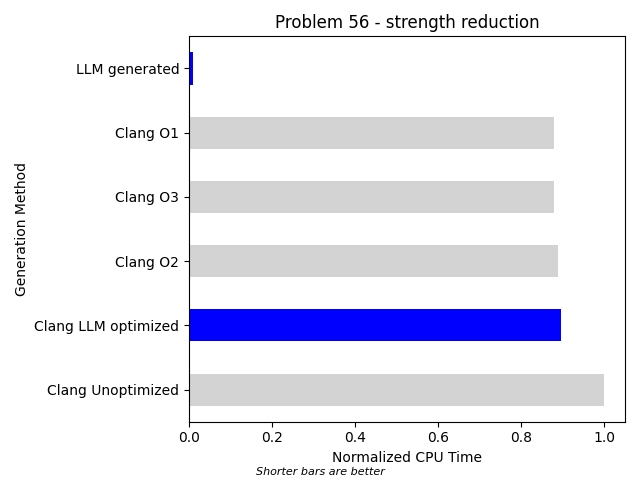

## Problem 57
### Compilation Unit
```c

void customFunction(int int1, int int2, double double1, double double2, int *outInt, double *outDouble) {
    *outInt = (int1 * 6) - (int1 * 2);
    *outDouble = (double1 * 7) - (double1 * 3);
}

```
- Generated Assembly: [Clang O1](../problems/57/generated/clang_generated_O1_optimized.asm), [Clang O2](../problems/57/generated/clang_generated_O2_optimized.asm), [Clang O3](../problems/57/generated/clang_generated_O3_optimized.asm), **[Clang LLM optimized](../problems/57/generated/clang_generated_llm_optimized.asm)**, [Clang Unoptimized](../problems/57/generated/clang_generated_unoptimized.asm), **[LLM generated](../problems/57/generated/llm_generated.asm)**
### Results
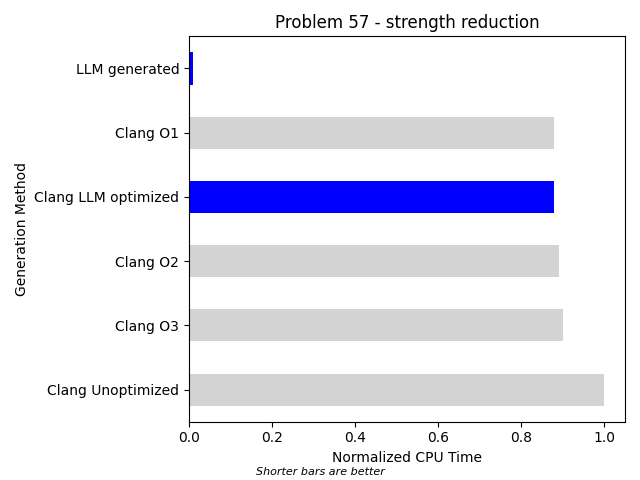

## Problem 58
### Compilation Unit
```c

void customFunction(int int1, int int2, double double1, double double2, int *outInt, double *outDouble) {
    *outInt = (int1 * 5) + (int1 * 2);
    *outDouble = (double1 * 6) + (double1 * 1);
}

```
- Generated Assembly: [Clang O1](../problems/58/generated/clang_generated_O1_optimized.asm), [Clang O2](../problems/58/generated/clang_generated_O2_optimized.asm), [Clang O3](../problems/58/generated/clang_generated_O3_optimized.asm), **[Clang LLM optimized](../problems/58/generated/clang_generated_llm_optimized.asm)**, [Clang Unoptimized](../problems/58/generated/clang_generated_unoptimized.asm), **[LLM generated](../problems/58/generated/llm_generated.asm)**
### Results


## Problem 59
### Compilation Unit
```c

void customFunction(int int1, int int2, double double1, double double2, int *outInt, double *outDouble) {
    *outInt = (int1 * 3) + (int1 * 4);
    *outDouble = (double1 * 2) + (double1 * 5);
}

```
- Generated Assembly: [Clang O1](../problems/59/generated/clang_generated_O1_optimized.asm), [Clang O2](../problems/59/generated/clang_generated_O2_optimized.asm), [Clang O3](../problems/59/generated/clang_generated_O3_optimized.asm), **[Clang LLM optimized](../problems/59/generated/clang_generated_llm_optimized.asm)**, [Clang Unoptimized](../problems/59/generated/clang_generated_unoptimized.asm), **[LLM generated](../problems/59/generated/llm_generated.asm)**
### Results
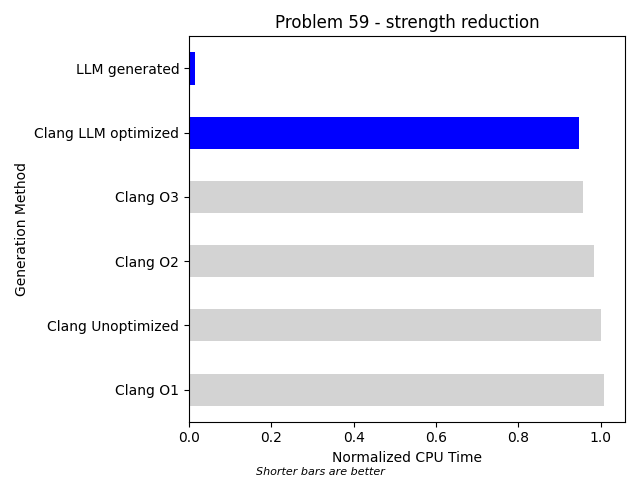

## Problem 60
### Compilation Unit
```c

void customFunction(int int1, int int2, double double1, double double2, int *outInt, double *outDouble) {
    *outInt = (int1 * 6) * 0.5;
    *outDouble = (double1 * 8) * 0.25;
}

```
- Generated Assembly: [Clang O1](../problems/60/generated/clang_generated_O1_optimized.asm), [Clang O2](../problems/60/generated/clang_generated_O2_optimized.asm), [Clang O3](../problems/60/generated/clang_generated_O3_optimized.asm), **[Clang LLM optimized](../problems/60/generated/clang_generated_llm_optimized.asm)**, [Clang Unoptimized](../problems/60/generated/clang_generated_unoptimized.asm), **[LLM generated](../problems/60/generated/llm_generated.asm)**
### Results
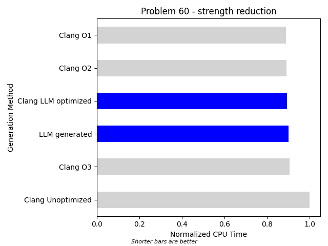

## Problem 61
### Compilation Unit
```c

void customFunction(int int1, int int2, 
					double double1, double double2, 
					int *outInt, double *outDouble) {
    int sum = 0;
    for (int i = 0; i < 4; i++) {
        sum += int1;
    }
    *outInt = sum;
    *outDouble = double1 + double2;
}

```
- Generated Assembly: [Clang O1](../problems/61/generated/clang_generated_O1_optimized.asm), [Clang O2](../problems/61/generated/clang_generated_O2_optimized.asm), [Clang O3](../problems/61/generated/clang_generated_O3_optimized.asm), **[Clang LLM optimized](../problems/61/generated/clang_generated_llm_optimized.asm)**, [Clang Unoptimized](../problems/61/generated/clang_generated_unoptimized.asm), **[LLM generated](../problems/61/generated/llm_generated.asm)**
### Results
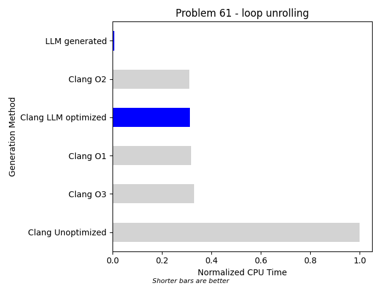

## Problem 62
### Compilation Unit
```c

void customFunction(int int1, int int2, 
					double double1, double double2, 
					int *outInt, double *outDouble) {
    double result = 0;
    for (int i = 0; i < 4; i++) {
        result += double1;
    }
    *outInt = int1 + int2;
    *outDouble = result;
}

```
- Generated Assembly: [Clang O1](../problems/62/generated/clang_generated_O1_optimized.asm), [Clang O2](../problems/62/generated/clang_generated_O2_optimized.asm), [Clang O3](../problems/62/generated/clang_generated_O3_optimized.asm), **[Clang LLM optimized](../problems/62/generated/clang_generated_llm_optimized.asm)**, [Clang Unoptimized](../problems/62/generated/clang_generated_unoptimized.asm), **[LLM generated](../problems/62/generated/llm_generated.asm)**
### Results
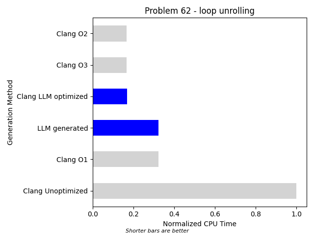

## Problem 63
### Compilation Unit
```c

static double helper(double val) {
    return val * 2;
}

void customFunction(int int1, int int2, 
					double double1, double double2, 
					int *outInt, double *outDouble) {
    double result = 0;
    for (int i = 0; i < 3; i++) {
        result += helper(double2);
    }
    *outInt = int1;
    *outDouble = result;
}

```
- Generated Assembly: [Clang O1](../problems/63/generated/clang_generated_O1_optimized.asm), [Clang O2](../problems/63/generated/clang_generated_O2_optimized.asm), [Clang O3](../problems/63/generated/clang_generated_O3_optimized.asm), **[Clang LLM optimized](../problems/63/generated/clang_generated_llm_optimized.asm)**, [Clang Unoptimized](../problems/63/generated/clang_generated_unoptimized.asm), **[LLM generated](../problems/63/generated/llm_generated.asm)**
### Results
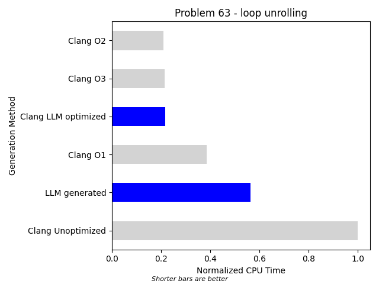

## Problem 64
### Compilation Unit
```c

void customFunction(int int1, int int2, 
					double double1, double double2, 
					int *outInt, double *outDouble) {
    int sum = 0;
    for (int i = 0; i < 2; i++) {
        sum += int2;
    }
    *outInt = sum + int1;
    *outDouble = double1;
}

```
- Generated Assembly: [Clang O1](../problems/64/generated/clang_generated_O1_optimized.asm), [Clang O2](../problems/64/generated/clang_generated_O2_optimized.asm), [Clang O3](../problems/64/generated/clang_generated_O3_optimized.asm), **[Clang LLM optimized](../problems/64/generated/clang_generated_llm_optimized.asm)**, [Clang Unoptimized](../problems/64/generated/clang_generated_unoptimized.asm), **[LLM generated](../problems/64/generated/llm_generated.asm)**
### Results
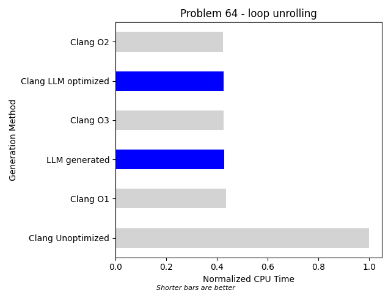

## Problem 65
### Compilation Unit
```c

void customFunction(int int1, int int2, 
					double double1, double double2, 
					int *outInt, double *outDouble) {
    double result = 0;
    for (int i = 0; i < 5; i++) {
        result += double1;
    }
    *outInt = int2;
    *outDouble = result;
}

```
- Generated Assembly: [Clang O1](../problems/65/generated/clang_generated_O1_optimized.asm), [Clang O2](../problems/65/generated/clang_generated_O2_optimized.asm), [Clang O3](../problems/65/generated/clang_generated_O3_optimized.asm), **[Clang LLM optimized](../problems/65/generated/clang_generated_llm_optimized.asm)**, [Clang Unoptimized](../problems/65/generated/clang_generated_unoptimized.asm), **[LLM generated](../problems/65/generated/llm_generated.asm)**
### Results
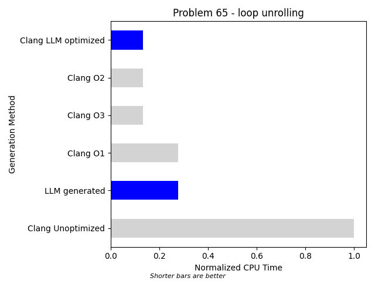

## Problem 66
### Compilation Unit
```c

void customFunction(int int1, int int2, double double1, double double2, int *outInt, double *outDouble) {
    for (int i = 0; i < 4; i++) {
        *outDouble = double1 - double2;
    }
}
    
```
- Generated Assembly: [Clang O1](../problems/66/generated/clang_generated_O1_optimized.asm), [Clang O2](../problems/66/generated/clang_generated_O2_optimized.asm), [Clang O3](../problems/66/generated/clang_generated_O3_optimized.asm), **[Clang LLM optimized](../problems/66/generated/clang_generated_llm_optimized.asm)**, [Clang Unoptimized](../problems/66/generated/clang_generated_unoptimized.asm), **[LLM generated](../problems/66/generated/llm_generated.asm)**
### Results
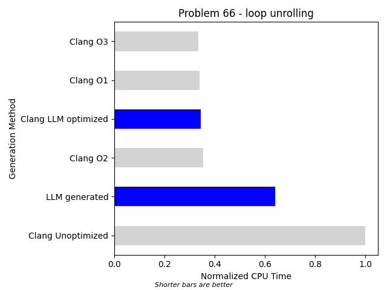

## Problem 67
### Compilation Unit
```c

void customFunction(int int1, int int2, 
					double double1, double double2, 
					int *outInt, double *outDouble) {
    int result = 0;
    for (int i = 0; i < (int1 & 3); i++) {
        result += int2;
    }
    *outInt = result;
    *outDouble = double1 + double2;
}

```
- Generated Assembly: [Clang O1](../problems/67/generated/clang_generated_O1_optimized.asm), [Clang O2](../problems/67/generated/clang_generated_O2_optimized.asm), [Clang O3](../problems/67/generated/clang_generated_O3_optimized.asm), **[Clang LLM optimized](../problems/67/generated/clang_generated_llm_optimized.asm)**, [Clang Unoptimized](../problems/67/generated/clang_generated_unoptimized.asm), **[LLM generated](../problems/67/generated/llm_generated.asm)**
### Results
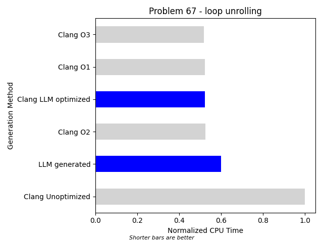

## Problem 68
### Compilation Unit
```c

void customFunction(int int1, int int2, double double1, double double2, int *outInt, double *outDouble) {
    for (int i = 0; i < 4; i++) {
        *outInt = int1 * int1;
    }
}
    
```
- Generated Assembly: [Clang O1](../problems/68/generated/clang_generated_O1_optimized.asm), [Clang O2](../problems/68/generated/clang_generated_O2_optimized.asm), [Clang O3](../problems/68/generated/clang_generated_O3_optimized.asm), **[Clang LLM optimized](../problems/68/generated/clang_generated_llm_optimized.asm)**, [Clang Unoptimized](../problems/68/generated/clang_generated_unoptimized.asm), **[LLM generated](../problems/68/generated/llm_generated.asm)**
### Results
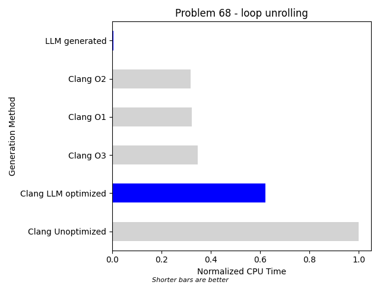

## Problem 69
### Compilation Unit
```c

void customFunction(int int1, int int2, double double1, double double2, int *outInt, double *outDouble) {
    for (int i = 0; i < 4; i++) {
        *outInt = int1 + int2;
    }
}
    
```
- Generated Assembly: [Clang O1](../problems/69/generated/clang_generated_O1_optimized.asm), [Clang O2](../problems/69/generated/clang_generated_O2_optimized.asm), [Clang O3](../problems/69/generated/clang_generated_O3_optimized.asm), **[Clang LLM optimized](../problems/69/generated/clang_generated_llm_optimized.asm)**, [Clang Unoptimized](../problems/69/generated/clang_generated_unoptimized.asm), **[LLM generated](../problems/69/generated/llm_generated.asm)**
### Results
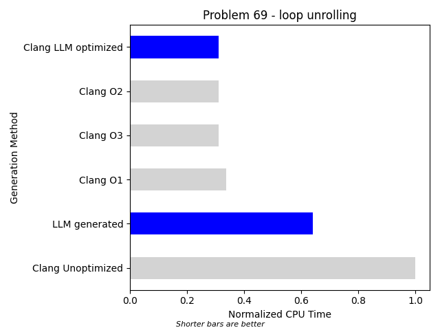

## Problem 70
### Compilation Unit
```c

void customFunction(int int1, int int2, double double1, double double2, int *outInt, double *outDouble) {
    for (int i = 0; i < 4; i++) {
        *outDouble = (int1 + int2 + double1 + double2) / 4.0;
    }
}
    
```
- Generated Assembly: [Clang O1](../problems/70/generated/clang_generated_O1_optimized.asm), [Clang O2](../problems/70/generated/clang_generated_O2_optimized.asm), [Clang O3](../problems/70/generated/clang_generated_O3_optimized.asm), **[Clang LLM optimized](../problems/70/generated/clang_generated_llm_optimized.asm)**, [Clang Unoptimized](../problems/70/generated/clang_generated_unoptimized.asm), **[LLM generated](../problems/70/generated/llm_generated.asm)**
### Results
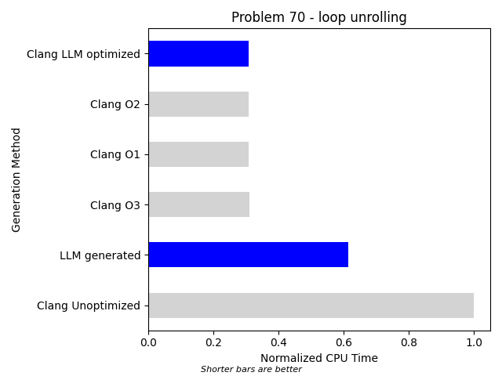

## Problem 71
### Compilation Unit
```c

void customFunction(int int1, int int2, double double1, double double2, int *outInt, double *outDouble) {
    for (int i = 0; i < 2; i++) {
        *outInt = int1;
    }
}
    
```
- Generated Assembly: [Clang O1](../problems/71/generated/clang_generated_O1_optimized.asm), [Clang O2](../problems/71/generated/clang_generated_O2_optimized.asm), [Clang O3](../problems/71/generated/clang_generated_O3_optimized.asm), **[Clang LLM optimized](../problems/71/generated/clang_generated_llm_optimized.asm)**, [Clang Unoptimized](../problems/71/generated/clang_generated_unoptimized.asm), **[LLM generated](../problems/71/generated/llm_generated.asm)**
### Results


## Problem 72
### Compilation Unit
```c

void customFunction(int int1, int int2, double double1, double double2, int *outInt, double *outDouble) {
    for (int i = 0; i < 2; i++) {
        *outInt = int2;
    }
}
    
```
- Generated Assembly: [Clang O1](../problems/72/generated/clang_generated_O1_optimized.asm), [Clang O2](../problems/72/generated/clang_generated_O2_optimized.asm), [Clang O3](../problems/72/generated/clang_generated_O3_optimized.asm), **[Clang LLM optimized](../problems/72/generated/clang_generated_llm_optimized.asm)**, [Clang Unoptimized](../problems/72/generated/clang_generated_unoptimized.asm), **[LLM generated](../problems/72/generated/llm_generated.asm)**
### Results
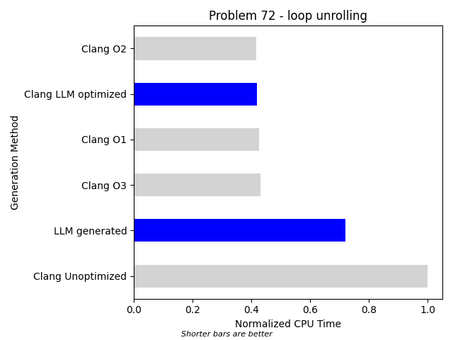

## Problem 73
### Compilation Unit
```c

void customFunction(int int1, int int2, double double1, double double2, int *outInt, double *outDouble) {
    for (int i = 0; i < 2; i++) {
        *outDouble = double1;
    }
}
    
```
- Generated Assembly: [Clang O1](../problems/73/generated/clang_generated_O1_optimized.asm), [Clang O2](../problems/73/generated/clang_generated_O2_optimized.asm), [Clang O3](../problems/73/generated/clang_generated_O3_optimized.asm), **[Clang LLM optimized](../problems/73/generated/clang_generated_llm_optimized.asm)**, [Clang Unoptimized](../problems/73/generated/clang_generated_unoptimized.asm), **[LLM generated](../problems/73/generated/llm_generated.asm)**
### Results


## Problem 74
### Compilation Unit
```c

void customFunction(int int1, int int2, double double1, double double2, int *outInt, double *outDouble) {
    for (int i = 0; i < 2; i++) {
        *outDouble = double2;
    }
}
    
```
- Generated Assembly: [Clang O1](../problems/74/generated/clang_generated_O1_optimized.asm), [Clang O2](../problems/74/generated/clang_generated_O2_optimized.asm), [Clang O3](../problems/74/generated/clang_generated_O3_optimized.asm), **[Clang LLM optimized](../problems/74/generated/clang_generated_llm_optimized.asm)**, [Clang Unoptimized](../problems/74/generated/clang_generated_unoptimized.asm), **[LLM generated](../problems/74/generated/llm_generated.asm)**
### Results


## Problem 75
### Compilation Unit
```c

void customFunction(int int1, int int2, double double1, double double2, int *outInt, double *outDouble) {
    for (int i = 0; i < 2; i++) {
        *outInt = int1 + int2;
    }
}
    
```
- Generated Assembly: [Clang O1](../problems/75/generated/clang_generated_O1_optimized.asm), [Clang O2](../problems/75/generated/clang_generated_O2_optimized.asm), [Clang O3](../problems/75/generated/clang_generated_O3_optimized.asm), **[Clang LLM optimized](../problems/75/generated/clang_generated_llm_optimized.asm)**, [Clang Unoptimized](../problems/75/generated/clang_generated_unoptimized.asm), **[LLM generated](../problems/75/generated/llm_generated.asm)**
### Results


## Problem 76
### Compilation Unit
```c

void customFunction(int int1, int int2, double double1, double double2, int *outInt, double *outDouble) {
    for (int i = 0; i < 2; i++) {
        *outDouble = double1 + double2;
    }
}
    
```
- Generated Assembly: [Clang O1](../problems/76/generated/clang_generated_O1_optimized.asm), [Clang O2](../problems/76/generated/clang_generated_O2_optimized.asm), [Clang O3](../problems/76/generated/clang_generated_O3_optimized.asm), **[Clang LLM optimized](../problems/76/generated/clang_generated_llm_optimized.asm)**, [Clang Unoptimized](../problems/76/generated/clang_generated_unoptimized.asm), **[LLM generated](../problems/76/generated/llm_generated.asm)**
### Results
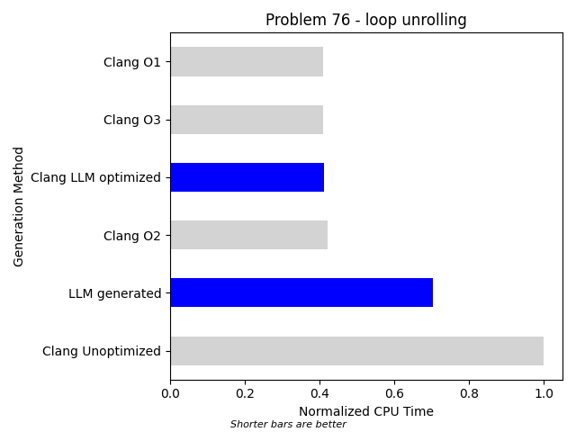

## Problem 77
### Compilation Unit
```c

void customFunction(int int1, int int2, double double1, double double2, int *outInt, double *outDouble) {
    for (int i = 0; i < 2; i++) {
        *outInt = int1 - int2;
    }
}
    
```
- Generated Assembly: [Clang O1](../problems/77/generated/clang_generated_O1_optimized.asm), [Clang O2](../problems/77/generated/clang_generated_O2_optimized.asm), [Clang O3](../problems/77/generated/clang_generated_O3_optimized.asm), **[Clang LLM optimized](../problems/77/generated/clang_generated_llm_optimized.asm)**, [Clang Unoptimized](../problems/77/generated/clang_generated_unoptimized.asm), **[LLM generated](../problems/77/generated/llm_generated.asm)**
### Results
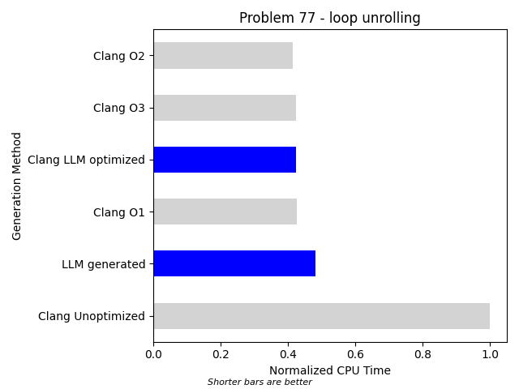

## Problem 78
### Compilation Unit
```c

void customFunction(int int1, int int2, double double1, double double2, int *outInt, double *outDouble) {
    for (int i = 0; i < 2; i++) {
        *outDouble = double1 - double2;
    }
}
    
```
- Generated Assembly: [Clang O1](../problems/78/generated/clang_generated_O1_optimized.asm), [Clang O2](../problems/78/generated/clang_generated_O2_optimized.asm), [Clang O3](../problems/78/generated/clang_generated_O3_optimized.asm), **[Clang LLM optimized](../problems/78/generated/clang_generated_llm_optimized.asm)**, [Clang Unoptimized](../problems/78/generated/clang_generated_unoptimized.asm), **[LLM generated](../problems/78/generated/llm_generated.asm)**
### Results


## Problem 79
### Compilation Unit
```c

void customFunction(int int1, int int2, double double1, double double2, int *outInt, double *outDouble) {
    for (int i = 0; i < 2; i++) {
        *outInt = int1 * 2;
    }
}
    
```
- Generated Assembly: [Clang O1](../problems/79/generated/clang_generated_O1_optimized.asm), [Clang O2](../problems/79/generated/clang_generated_O2_optimized.asm), [Clang O3](../problems/79/generated/clang_generated_O3_optimized.asm), **[Clang LLM optimized](../problems/79/generated/clang_generated_llm_optimized.asm)**, [Clang Unoptimized](../problems/79/generated/clang_generated_unoptimized.asm), **[LLM generated](../problems/79/generated/llm_generated.asm)**
### Results
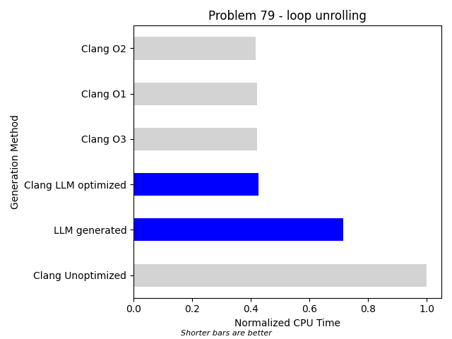

## Problem 80
### Compilation Unit
```c

void customFunction(int int1, int int2, double double1, double double2, int *outInt, double *outDouble) {
    for (int i = 0; i < 2; i++) {
        *outDouble = double1 * 2.0;
    }
}
    
```
- Generated Assembly: [Clang O1](../problems/80/generated/clang_generated_O1_optimized.asm), [Clang O2](../problems/80/generated/clang_generated_O2_optimized.asm), [Clang O3](../problems/80/generated/clang_generated_O3_optimized.asm), **[Clang LLM optimized](../problems/80/generated/clang_generated_llm_optimized.asm)**, [Clang Unoptimized](../problems/80/generated/clang_generated_unoptimized.asm), **[LLM generated](../problems/80/generated/llm_generated.asm)**
### Results
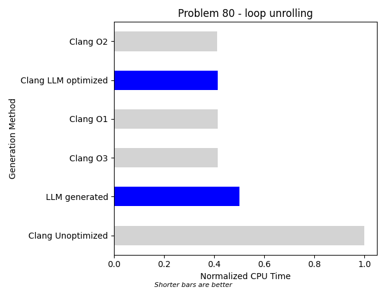

## Problem 81
### Compilation Unit
```c

void customFunction(int int1, int int2, double double1, double double2, int *outInt, double *outDouble) {
    int a = int1;
    int b = a;
    *outInt = b;
    double x = double1;
    double y = x;
    *outDouble = y;
}

```
- Generated Assembly: [Clang O1](../problems/81/generated/clang_generated_O1_optimized.asm), [Clang O2](../problems/81/generated/clang_generated_O2_optimized.asm), [Clang O3](../problems/81/generated/clang_generated_O3_optimized.asm), **[Clang LLM optimized](../problems/81/generated/clang_generated_llm_optimized.asm)**, [Clang Unoptimized](../problems/81/generated/clang_generated_unoptimized.asm), **[LLM generated](../problems/81/generated/llm_generated.asm)**
### Results
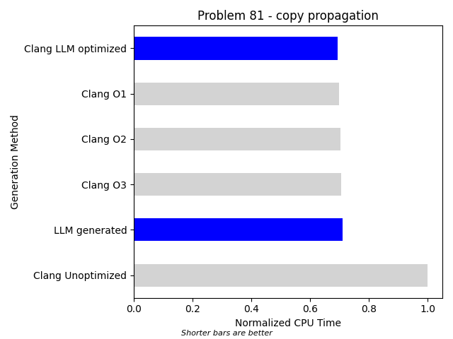

## Problem 82
### Compilation Unit
```c

void customFunction(int int1, int int2, double double1, double double2, int *outInt, double *outDouble) {
    int a = int1 + int2;
    int b = a;
    *outInt = b + int2;
    double x = double1 - double2;
    double y = x;
    *outDouble = y + double1;
}

```
- Generated Assembly: [Clang O1](../problems/82/generated/clang_generated_O1_optimized.asm), [Clang O2](../problems/82/generated/clang_generated_O2_optimized.asm), [Clang O3](../problems/82/generated/clang_generated_O3_optimized.asm), **[Clang LLM optimized](../problems/82/generated/clang_generated_llm_optimized.asm)**, [Clang Unoptimized](../problems/82/generated/clang_generated_unoptimized.asm), **[LLM generated](../problems/82/generated/llm_generated.asm)**
### Results
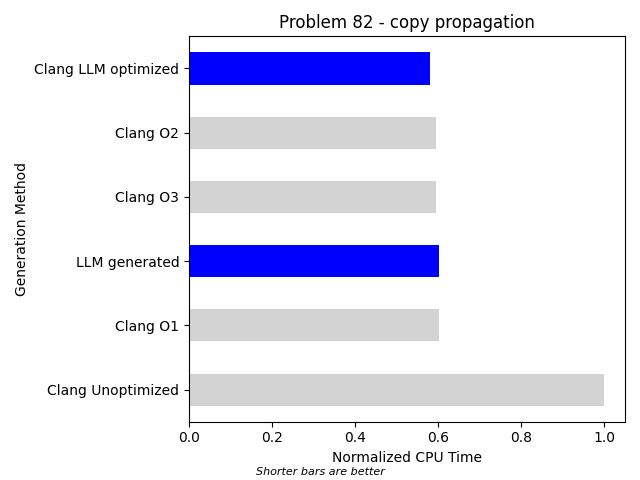

## Problem 83
### Compilation Unit
```c

void customFunction(int int1, int int2, double double1, double double2, int *outInt, double *outDouble) {
    int a = int1 * 2;
    int b = a;
    *outInt = b;
    double x = double1 * 0.5;
    double y = x;
    *outDouble = y;
}

```
- Generated Assembly: [Clang O1](../problems/83/generated/clang_generated_O1_optimized.asm), [Clang O2](../problems/83/generated/clang_generated_O2_optimized.asm), [Clang O3](../problems/83/generated/clang_generated_O3_optimized.asm), **[Clang LLM optimized](../problems/83/generated/clang_generated_llm_optimized.asm)**, [Clang Unoptimized](../problems/83/generated/clang_generated_unoptimized.asm), **[LLM generated](../problems/83/generated/llm_generated.asm)**
### Results
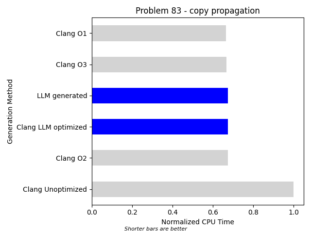

## Problem 84
### Compilation Unit
```c

void customFunction(int int1, int int2, double double1, double double2, int *outInt, double *outDouble) {
    int temp = int1;
    int a = temp;
    int b = a;
    *outInt = b;
    double tempD = double2;
    double x = tempD;
    double y = x;
    *outDouble = y;
}

```
- Generated Assembly: [Clang O1](../problems/84/generated/clang_generated_O1_optimized.asm), [Clang O2](../problems/84/generated/clang_generated_O2_optimized.asm), [Clang O3](../problems/84/generated/clang_generated_O3_optimized.asm), **[Clang LLM optimized](../problems/84/generated/clang_generated_llm_optimized.asm)**, [Clang Unoptimized](../problems/84/generated/clang_generated_unoptimized.asm), **[LLM generated](../problems/84/generated/llm_generated.asm)**
### Results
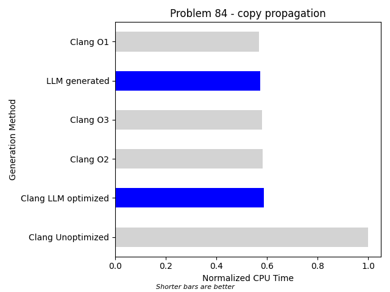

## Problem 85
### Compilation Unit
```c

void customFunction(int int1, int int2, double double1, double double2, int *outInt, double *outDouble) {
    int a = int1 - int2;
    int b = a;
    *outInt = b;
    double x = double2 + double1;
    double y = x;
    *outDouble = y;
}

```
- Generated Assembly: [Clang O1](../problems/85/generated/clang_generated_O1_optimized.asm), [Clang O2](../problems/85/generated/clang_generated_O2_optimized.asm), [Clang O3](../problems/85/generated/clang_generated_O3_optimized.asm), **[Clang LLM optimized](../problems/85/generated/clang_generated_llm_optimized.asm)**, [Clang Unoptimized](../problems/85/generated/clang_generated_unoptimized.asm), **[LLM generated](../problems/85/generated/llm_generated.asm)**
### Results


## Problem 86
### Compilation Unit
```c

void customFunction(int int1, int int2, double double1, double double2, int *outInt, double *outDouble) {
    int temp = int2;
    int a = temp;
    int b = a;
    *outInt = b;
    double tempD = double1;
    double x = tempD;
    double y = x;
    *outDouble = y;
}

```
- Generated Assembly: [Clang O1](../problems/86/generated/clang_generated_O1_optimized.asm), [Clang O2](../problems/86/generated/clang_generated_O2_optimized.asm), [Clang O3](../problems/86/generated/clang_generated_O3_optimized.asm), **[Clang LLM optimized](../problems/86/generated/clang_generated_llm_optimized.asm)**, [Clang Unoptimized](../problems/86/generated/clang_generated_unoptimized.asm), **[LLM generated](../problems/86/generated/llm_generated.asm)**
### Results
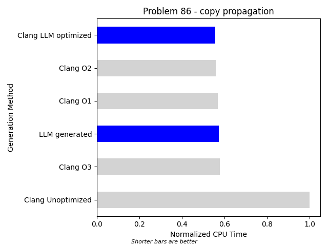

## Problem 87
### Compilation Unit
```c

void customFunction(int int1, int int2, double double1, double double2, int *outInt, double *outDouble) {
    int a = int1 * 3;
    int b = a;
    *outInt = b;
    double x = double2 * 0.25;
    double y = x;
    *outDouble = y;
}

```
- Generated Assembly: [Clang O1](../problems/87/generated/clang_generated_O1_optimized.asm), [Clang O2](../problems/87/generated/clang_generated_O2_optimized.asm), [Clang O3](../problems/87/generated/clang_generated_O3_optimized.asm), **[Clang LLM optimized](../problems/87/generated/clang_generated_llm_optimized.asm)**, [Clang Unoptimized](../problems/87/generated/clang_generated_unoptimized.asm), **[LLM generated](../problems/87/generated/llm_generated.asm)**
### Results
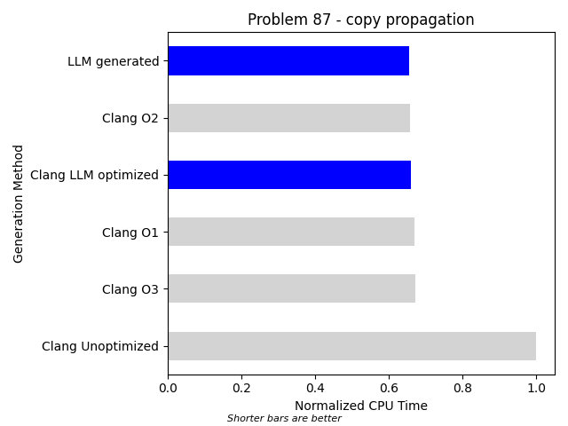

## Problem 88
### Compilation Unit
```c

void customFunction(int int1, int int2, double double1, double double2, int *outInt, double *outDouble) {
    int temp = int1 + int2;
    int a = temp;
    int b = a;
    *outInt = b;
    double tempD = double1 - double2;
    double x = tempD;
    double y = x;
    *outDouble = y;
}

```
- Generated Assembly: [Clang O1](../problems/88/generated/clang_generated_O1_optimized.asm), [Clang O2](../problems/88/generated/clang_generated_O2_optimized.asm), [Clang O3](../problems/88/generated/clang_generated_O3_optimized.asm), **[Clang LLM optimized](../problems/88/generated/clang_generated_llm_optimized.asm)**, [Clang Unoptimized](../problems/88/generated/clang_generated_unoptimized.asm), **[LLM generated](../problems/88/generated/llm_generated.asm)**
### Results
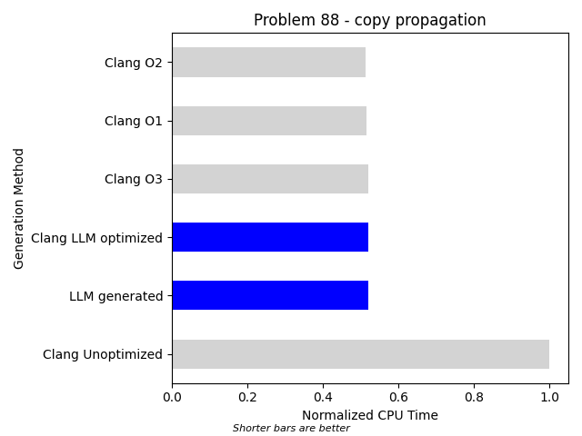

## Problem 89
### Compilation Unit
```c

void customFunction(int int1, int int2, double double1, double double2, int *outInt, double *outDouble) {
    int a = int2 * 4;
    int b = a;
    *outInt = b;
    double x = double2 * 0.75;
    double y = x;
    *outDouble = y;
}

```
- Generated Assembly: [Clang O1](../problems/89/generated/clang_generated_O1_optimized.asm), [Clang O2](../problems/89/generated/clang_generated_O2_optimized.asm), [Clang O3](../problems/89/generated/clang_generated_O3_optimized.asm), **[Clang LLM optimized](../problems/89/generated/clang_generated_llm_optimized.asm)**, [Clang Unoptimized](../problems/89/generated/clang_generated_unoptimized.asm), **[LLM generated](../problems/89/generated/llm_generated.asm)**
### Results
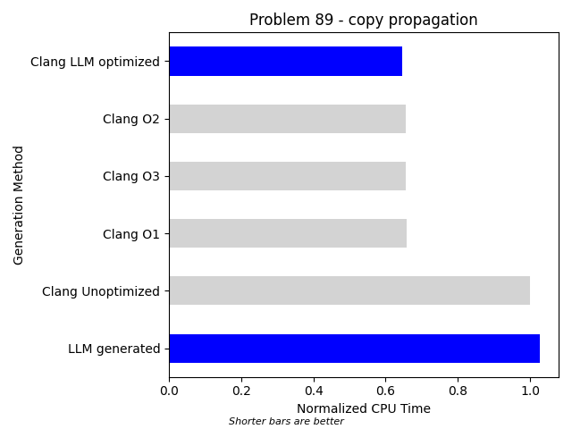

## Problem 90
### Compilation Unit
```c

void customFunction(int int1, int int2, double double1, double double2, int *outInt, double *outDouble) {
    int temp = int1 - int2;
    int a = temp;
    int b = a;
    *outInt = b;
    double tempD = double2 + double1;
    double x = tempD;
    double y = x;
    *outDouble = y;
}

```
- Generated Assembly: [Clang O1](../problems/90/generated/clang_generated_O1_optimized.asm), [Clang O2](../problems/90/generated/clang_generated_O2_optimized.asm), [Clang O3](../problems/90/generated/clang_generated_O3_optimized.asm), **[Clang LLM optimized](../problems/90/generated/clang_generated_llm_optimized.asm)**, [Clang Unoptimized](../problems/90/generated/clang_generated_unoptimized.asm), **[LLM generated](../problems/90/generated/llm_generated.asm)**
### Results
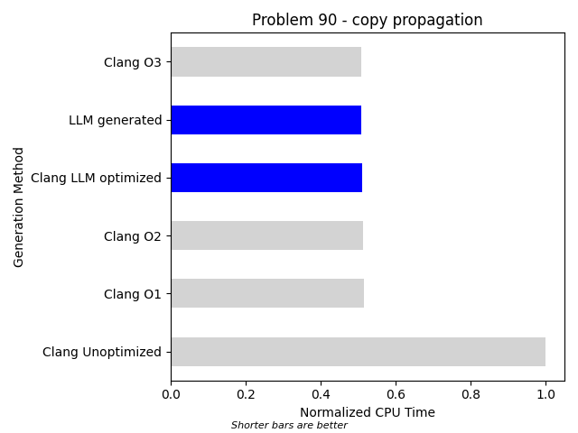

## Problem 91
### Compilation Unit
```c

void customFunction(int int1, int int2, double double1, double double2, int *outInt, double *outDouble) {
    int a = int1 + 5;
    int b = a;
    *outInt = b;
    double x = double1 * 1.1;
    double y = x;
    *outDouble = y;
}

```
- Generated Assembly: [Clang O1](../problems/91/generated/clang_generated_O1_optimized.asm), [Clang O2](../problems/91/generated/clang_generated_O2_optimized.asm), [Clang O3](../problems/91/generated/clang_generated_O3_optimized.asm), **[Clang LLM optimized](../problems/91/generated/clang_generated_llm_optimized.asm)**, [Clang Unoptimized](../problems/91/generated/clang_generated_unoptimized.asm), **[LLM generated](../problems/91/generated/llm_generated.asm)**
### Results


## Problem 92
### Compilation Unit
```c

void customFunction(int int1, int int2, double double1, double double2, int *outInt, double *outDouble) {
    int a = int2 - 3;
    int b = a;
    *outInt = b;
    double x = double2 * 1.2;
    double y = x;
    *outDouble = y;
}

```
- Generated Assembly: [Clang O1](../problems/92/generated/clang_generated_O1_optimized.asm), [Clang O2](../problems/92/generated/clang_generated_O2_optimized.asm), [Clang O3](../problems/92/generated/clang_generated_O3_optimized.asm), **[Clang LLM optimized](../problems/92/generated/clang_generated_llm_optimized.asm)**, [Clang Unoptimized](../problems/92/generated/clang_generated_unoptimized.asm), **[LLM generated](../problems/92/generated/llm_generated.asm)**
### Results
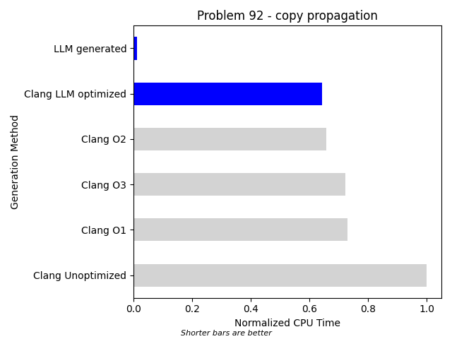

## Problem 93
### Compilation Unit
```c

void customFunction(int int1, int int2, double double1, double double2, int *outInt, double *outDouble) {
    int temp = int1 + 10;
    int a = temp;
    int b = a;
    *outInt = b;
    double tempD = double1 * 1.3;
    double x = tempD;
    double y = x;
    *outDouble = y;
}

```
- Generated Assembly: [Clang O1](../problems/93/generated/clang_generated_O1_optimized.asm), [Clang O2](../problems/93/generated/clang_generated_O2_optimized.asm), [Clang O3](../problems/93/generated/clang_generated_O3_optimized.asm), **[Clang LLM optimized](../problems/93/generated/clang_generated_llm_optimized.asm)**, [Clang Unoptimized](../problems/93/generated/clang_generated_unoptimized.asm), **[LLM generated](../problems/93/generated/llm_generated.asm)**
### Results
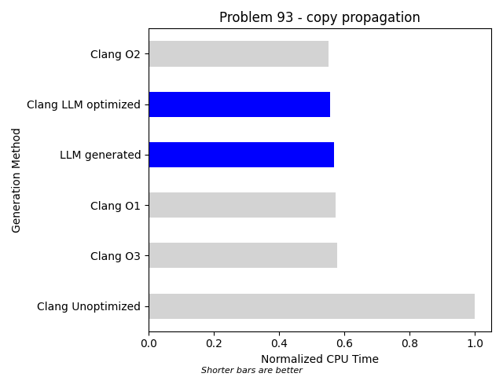

## Problem 94
### Compilation Unit
```c

void customFunction(int int1, int int2, double double1, double double2, int *outInt, double *outDouble) {
    int temp = int2 - 8;
    int a = temp;
    int b = a;
    *outInt = b;
    double tempD = double2 * 1.4;
    double x = tempD;
    double y = x;
    *outDouble = y;
}

```
- Generated Assembly: [Clang O1](../problems/94/generated/clang_generated_O1_optimized.asm), [Clang O2](../problems/94/generated/clang_generated_O2_optimized.asm), [Clang O3](../problems/94/generated/clang_generated_O3_optimized.asm), **[Clang LLM optimized](../problems/94/generated/clang_generated_llm_optimized.asm)**, [Clang Unoptimized](../problems/94/generated/clang_generated_unoptimized.asm), **[LLM generated](../problems/94/generated/llm_generated.asm)**
### Results
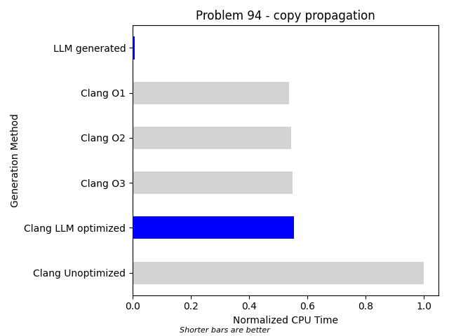

## Problem 95
### Compilation Unit
```c

void customFunction(int int1, int int2, double double1, double double2, int *outInt, double *outDouble) {
    int a = int1 * 6;
    int b = a;
    *outInt = b;
    double x = double1 * 1.5;
    double y = x;
    *outDouble = y;
}

```
- Generated Assembly: [Clang O1](../problems/95/generated/clang_generated_O1_optimized.asm), [Clang O2](../problems/95/generated/clang_generated_O2_optimized.asm), [Clang O3](../problems/95/generated/clang_generated_O3_optimized.asm), **[Clang LLM optimized](../problems/95/generated/clang_generated_llm_optimized.asm)**, [Clang Unoptimized](../problems/95/generated/clang_generated_unoptimized.asm), **[LLM generated](../problems/95/generated/llm_generated.asm)**
### Results


## Problem 96
### Compilation Unit
```c

void customFunction(int int1, int int2, double double1, double double2, int *outInt, double *outDouble) {
    int a = int2 * 7;
    int b = a;
    *outInt = b;
    double x = double2 * 1.6;
    double y = x;
    *outDouble = y;
}

```
- Generated Assembly: [Clang O1](../problems/96/generated/clang_generated_O1_optimized.asm), [Clang O2](../problems/96/generated/clang_generated_O2_optimized.asm), [Clang O3](../problems/96/generated/clang_generated_O3_optimized.asm), **[Clang LLM optimized](../problems/96/generated/clang_generated_llm_optimized.asm)**, [Clang Unoptimized](../problems/96/generated/clang_generated_unoptimized.asm), **[LLM generated](../problems/96/generated/llm_generated.asm)**
### Results
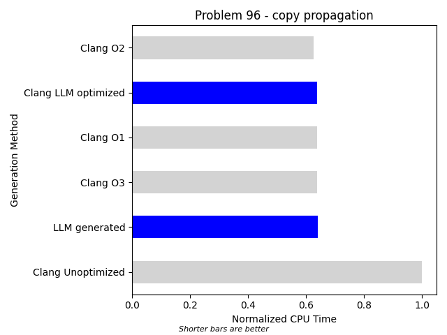

## Problem 97
### Compilation Unit
```c

void customFunction(int int1, int int2, double double1, double double2, int *outInt, double *outDouble) {
    int temp = int1 + 12;
    int a = temp;
    int b = a;
    *outInt = b;
    double tempD = double1 * 1.7;
    double x = tempD;
    double y = x;
    *outDouble = y;
}

```
- Generated Assembly: [Clang O1](../problems/97/generated/clang_generated_O1_optimized.asm), [Clang O2](../problems/97/generated/clang_generated_O2_optimized.asm), [Clang O3](../problems/97/generated/clang_generated_O3_optimized.asm), **[Clang LLM optimized](../problems/97/generated/clang_generated_llm_optimized.asm)**, [Clang Unoptimized](../problems/97/generated/clang_generated_unoptimized.asm), **[LLM generated](../problems/97/generated/llm_generated.asm)**
### Results
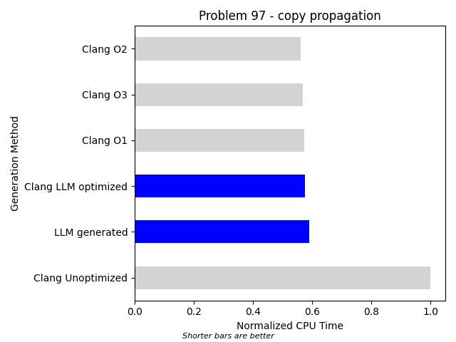

## Problem 98
### Compilation Unit
```c

void customFunction(int int1, int int2, double double1, double double2, int *outInt, double *outDouble) {
    int temp = int2 - 15;
    int a = temp;
    int b = a;
    *outInt = b;
    double tempD = double2 * 1.8;
    double x = tempD;
    double y = x;
    *outDouble = y;
}

```
- Generated Assembly: [Clang O1](../problems/98/generated/clang_generated_O1_optimized.asm), [Clang O2](../problems/98/generated/clang_generated_O2_optimized.asm), [Clang O3](../problems/98/generated/clang_generated_O3_optimized.asm), **[Clang LLM optimized](../problems/98/generated/clang_generated_llm_optimized.asm)**, [Clang Unoptimized](../problems/98/generated/clang_generated_unoptimized.asm), **[LLM generated](../problems/98/generated/llm_generated.asm)**
### Results


## Problem 99
### Compilation Unit
```c

void customFunction(int int1, int int2, double double1, double double2, int *outInt, double *outDouble) {
    int a = int1 * 9;
    int b = a;
    *outInt = b;
    double x = double1 * 1.9;
    double y = x;
    *outDouble = y;
}

```
- Generated Assembly: [Clang O1](../problems/99/generated/clang_generated_O1_optimized.asm), [Clang O2](../problems/99/generated/clang_generated_O2_optimized.asm), [Clang O3](../problems/99/generated/clang_generated_O3_optimized.asm), **[Clang LLM optimized](../problems/99/generated/clang_generated_llm_optimized.asm)**, [Clang Unoptimized](../problems/99/generated/clang_generated_unoptimized.asm), **[LLM generated](../problems/99/generated/llm_generated.asm)**
### Results
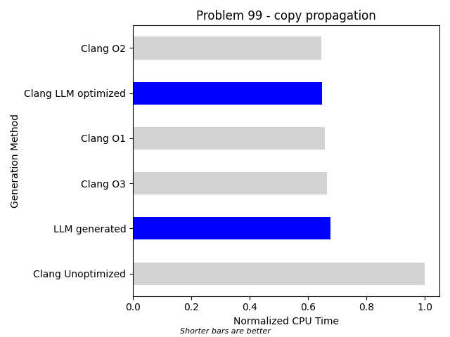

